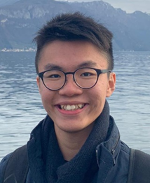
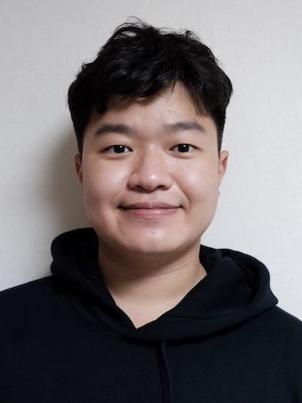
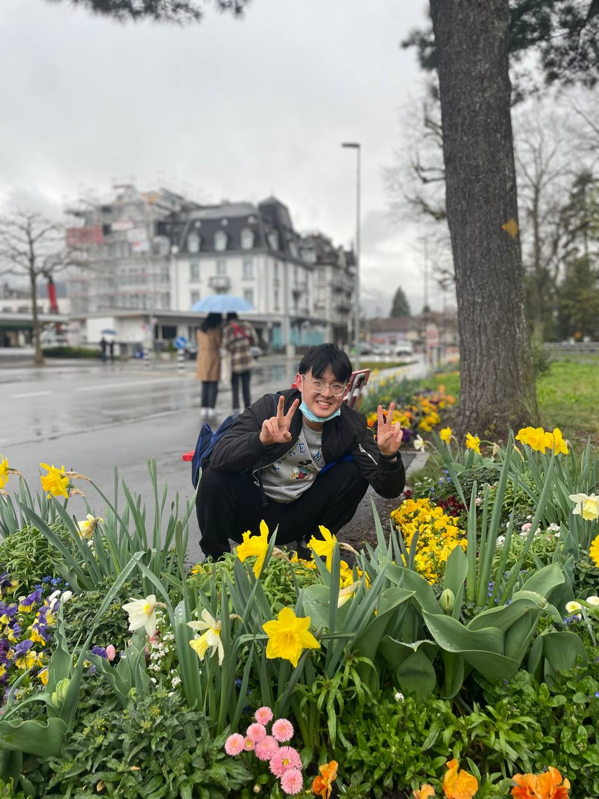

# About Us

We are a team based in the [School of Computing, National University of Singapore](http://www.comp.nus.edu.sg).

You can reach us at the email `seer[at]comp.nus.edu.sg`

## Project team

### Loysius Lam

[[github](https://github.com/blizzeracz)]
[[portfolio](team/blizzeracz.md)]

* Role: Project Advisor
* Responsibilities: Scheduling and tracking, Deliverables and deadlines

### Jason Baek

[[github](http://github.com/bkjwjason)]
[[portfolio](team/bkjwjason.md)]

* Role: Team Lead
* Responsibilities: UI, Java and Integration Expert

### Chang Xian

[[github](http://github.com/euchangxian)]
[[portfolio](team/euchangexian.md)]

* Role: Developer
* Responsibilities: Testing, Integration expert

### Ja Yee

[[github](http://github.com/wjayee)]
[[portfolio](team/wjayee.md)]

* Role: Developer
* Responsibilities: Code quality and Deliverables

### Jun Neng

[[github](http://github.com/junnengsoo)]
[[portfolio](team/junnengsoo.md)]

* Role: Developer
* Responsibilities: Code quality and Documentation
