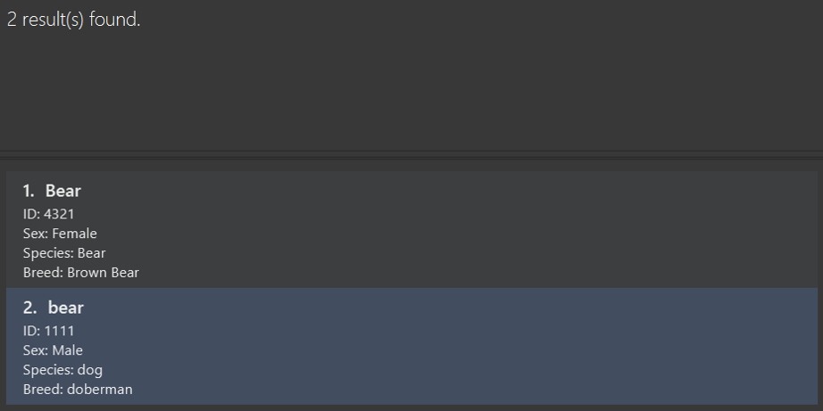
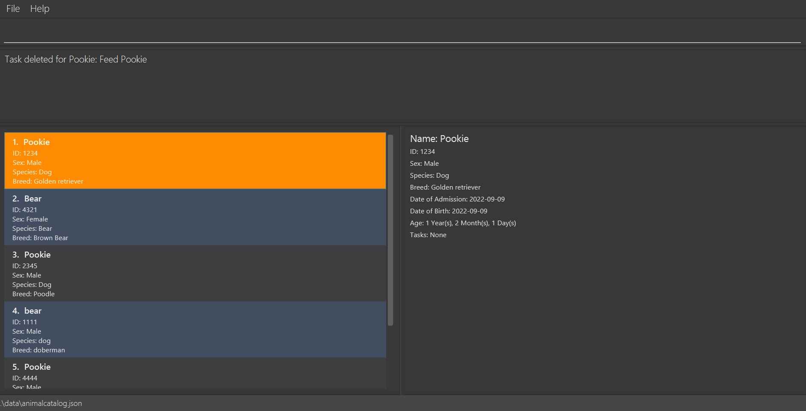
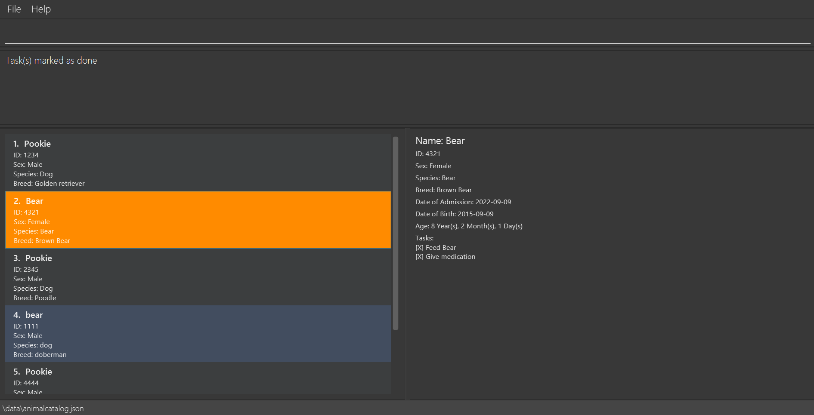
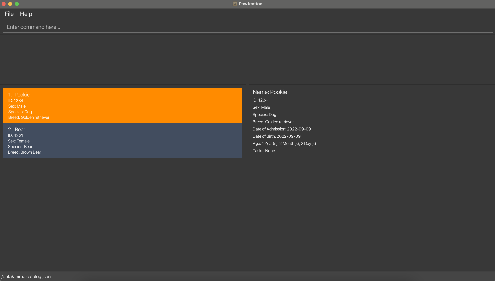
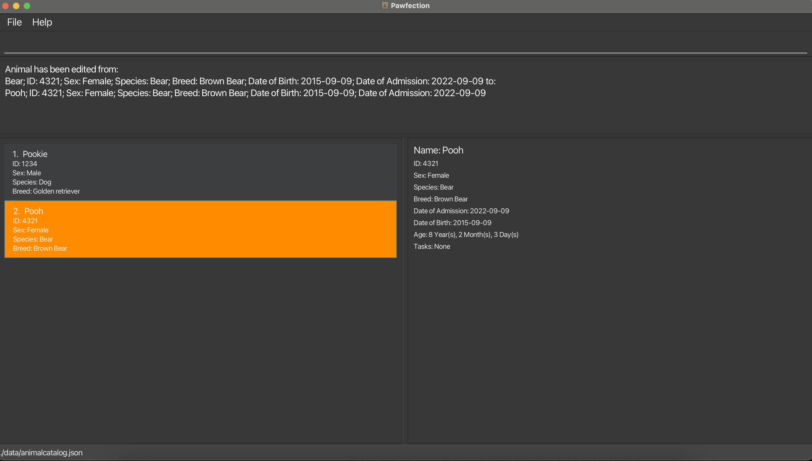

# Pawfection User Guide

Pawfection is a **desktop app for managing animals in a pet shelter, optimized for use via a Command Line Interface** (CLI) while still
having the benefits of a Graphical User Interface (GUI). It aims to provide a platform for volunteers to store and retrieve information
about animals in a shelter easily.

<!-- * Table of Contents -->
- [Quick start](#quick-start)
- [Features](#features)
    - [Attributes of `Animal`](#attributes-of-animal)
    - [Program usage help: `help`](#program-usage-help-help)
    - [Adding an animal: `add`](#adding-an-animal-add)
    - [Listing all animals: `list`](#listing-all-animals-list)
    - [Deleting an animal: `delete`](#deleting-an-animal-delete)
    - [Editing an animal: `edit`](#editing-an-animal-edit)
    - [Searching an animal: `search`](#searching-an-animal-search)
    - [Adds a task to an animal: `addtask`](#adds-a-task-to-an-animal-addtask)
    - [Deletes a task of an animal: `deletetask`](#deletes-a-task-of-an-animal-deletetask)
    - [Marking a task as done: `mark`](#marking-a-task-as-done-mark)
    - [Unmarking a task as done: `unmark`](#unmarking-a-task-as-done-unmark)
    - [Reset all tasks: `reset`](#reset-all-tasks-reset)
    - [Viewing animal details](#viewing-animal-details)
    - [Saving the data](#saving-the-data)
    - [Editing the data file](#editing-the-data-file)
- [FAQ](#faq)
- [Known issues](#known-issues)
- [Command summary](#command-summary)
--------------------------------------------------------------------------------------------------------------------

## Quick start

1. Ensure you have Java `11` or above installed in your Computer.

<box type="info" light>
<tabs>
<tab header="Windows">

1. Press Win+R.
2. Type cmd and press Enter to open your terminal.
3. Type `java --version` and press Enter to check if java is installed.
4. If Java is not installed on your computer, a red error message will pop up. In that case, see below on installing Java 11.
5. If Java is installed on your computer, some lines of white text will appear. Among these, there should be a line reading openjdk followed by a number, which is the version of Java. If you do not have Java 11 or later, see below on installing Java 11.

</tab>
<tab header="Mac">

1. Press Command+Space.
2. Type Terminal and press Enter to open your terminal.
3. Type `java --version` and press Enter to check if java is installed.
4. If Java is not installed on your computer, a red error message will pop up. In that case, see below on installing Java 11.
5. If Java is installed on your computer, some lines of white text will appear. Among these, there should be a line reading openjdk followed by a number, which is the version of Java. If you do not have Java 11 or later, see below on installing Java 11.

</tab>
<tab header="Linux">

1. Open the terminal.
2. Type `java --version` and press Enter to check if java is installed.
3. If Java is not installed on your computer, a red error message will pop up. In that case, see below on installing Java 11.
4. If Java is installed on your computer, some lines of white text will appear. Among these, there should be a line reading openjdk followed by a number, which is the version of Java. If you do not have Java 11 or later, see below on installing Java 11.

</tab>
</tabs>

If Java 11 is not installed, follow the instructions [here](https://www3.ntu.edu.sg/home/ehchua/programming/howto/jdk_howto.html) to install Java 11.
</box>

2. Download the latest `pawfection.jar`.

3. Copy the file to the folder you want to use as the _home folder_ for your Pawfection.

4. Open a command terminal, `cd` into the folder you put the jar file in, and use the `java -jar pawfection.jar` command to run the application. 
   A GUI similar to the below should appear in a few seconds. Note how the app contains some sample data. 

  

5. Type the command in the command box and press Enter to execute it. e.g. typing **`help`** and pressing Enter will open the help window.
   Typing the name of a command typing `help`, like `help add` will display the usage guide of the [add](#adding-an-animal-add) command.
   For more details, see [help](#program-usage-help-help) 
   Some example commands you can try:

    * `list` : Lists all contacts.

    * `add n/Pookie i/1234 g/MALE db/2019-01-01 da/2019-02-02 s/Dog b/Poodle` : Adds a dog named 'Pookie' to the Address Book.

    * `delete 3` : Deletes the animal with INDEX 3 in the displayed animal list.

6. Refer to the [Features](#features) below for details of each command.

--------------------------------------------------------------------------------------------------------------------

## Features

<box type="info" header="Notes about the command format:">

* Words in `UPPER_CASE` are the parameters to be supplied by the user. 
  e.g. in `add n/NAME`, `NAME` is a parameter which can be used as `add n/Pookie`.

* Items in square brackets are optional. 
  e.g `n/NAME [s/Dog]` can be used as `n/Pookie s/Dog` or as `n/Pookie`.

* Parameters can be in any order **EXCEPT** commands that take in `ANIMAL_INDEX` and `TASK_INDEX` as inputs. 
  e.g. if the command specifies `n/NAME db/DOB`, `db/DOB n/NAME` is also acceptable.

  <box type="warning" header="More information on the order of parameters">

  For commands which require both `ANIMAL_INDEX` and `TASK_INDEX` as inputs, the order in the format must be adhered to.
  E.g. for [`deletetask`](#deletes-a-task-of-an-animal-deletetask) which has the format `deletetask ANIMAL_INDEX TASK_INDEX`,
  specifying `deletetask TASK_INDEX ANIMAL_INDEX` is not **acceptable** and may produce unintended outcomes.

  </box>

* Extraneous parameters for commands that do not take in parameters (such as `list`) will be ignored. 
  e.g. if the command specifies `list 123`, it will be interpreted as `list`.

* Prefixes are **case-sensitive**. `n/` is not the same as `N/`.

* If you are using a PDF version of this document, be careful when copying and pasting commands that span multiple lines as space characters surrounding line-breaks may be omitted when copied over to the application.

</box>

<box type="warning">
For longer error messages stated in the user guide, they have been shortened for brevity by displaying only the first few words followed by ellipsis.
</box>

### Attributes of `Animal`
Summarized in the table below are the attributes of `Animal` along with their constraints. Users are encouraged to read through
this table for an idea of what the attributes are supposed to look like, and refer to this table if they are unsure.

Attributes of <code>Animal</code>

| Format      | Constraints                                                                        | Example                                                                                                                                 |
|-------------|------------------------------------------------------------------------------------|-----------------------------------------------------------------------------------------------------------------------------------------|
| `n/NAME`    | Alphanumeric, not blank                                                            | <ul><li>✅ <code>n/Pookie</code></li><li>✅ <code>n/P00k13</code></li><li>❌ <code>n/&nbsp;</code></li><li>❌ <code>n/Be@r</code></li></ul> |
| `i/ID`      | 4-digit, unique number                                                             | <ul><li>✅ <code>i/1234</code></li><li>❌ <code>i/123A</code></li></ul>                                                                   |
| `g/SEX`     | Male/Female, case-insensitive                                                      | <ul><li>✅ <code>g/MALE</code></li><li>✅ <code>g/female</code></li><li>❌ <code>g/Mala</code></li></ul>                                   |
| `s/SPECIES` | Alphabets, separated by singular whitespace                                        | <ul><li>✅ <code>s/Komodo Dragon</code></li><li>❌ <code>s/Komodo &nbsp; Dragon</code></li></ul>                                          |
| `b/BREED`   | Alphabets, separated by singular whitespace                                        | <ul><li>✅ <code>b/Golden Retriever</code></li><li>❌ <code>b/Golden &nbsp; Retriever</code></li></ul>                                    |
| `db/DOB`    | `yyyy-MM-dd` format. Not in the future. Not chronologically later than `DOA`   | <ul><li>✅ <code>db/2023-01-01</code></li><li>❌ <code>db/2023-1-1</code></li></ul>                                                       |
| `da/DOA`    | `yyyy-MM-dd` format. Not in the future. Not chronologically earlier than `DOB` | <ul><li>✅ <code>da/2023-05-05</code></li></ul>                                                                                          |

--------------------------------------------------------------------------------------------------------------------

### Program usage help: `help`
Displays either a link to this User Guide in a pop-up, or the usage guide of the specified command.

 **Format:**
 <box>help [COMMAND_NAME]</box>

**Examples:**
* `help`
* `help add`
* `help del`

**Things to note:**
* `COMMAND_NAME` is case-insensitive, and is able to do partial matches. E.g. "a", "ad", "dd", "AdD" will all match with "add".

**Upon success:**

`help` will produce a link to the User Guide in a pop-up.

  

`help add` will show usage guide of all commands that partial match with `add`.

  

**Upon failure:**
* Inputs that result in no partial matches will produce the following error message:

  <box type="wrong">Command: COMMAND_NAME not recognized!</box>

--------------------------------------------------------------------------------------------------------------------

### Adding an animal: `add`
Adds an animal to the animal catalog.

**Format:**
<box>
add n/NAME i/ID g/SEX s/SPECIES b/BREED db/DOB da/DOA
</box>

**Examples:**
* `add n/Pookie i/1234 g/MALE db/2019-01-01 da/2019-02-02 s/Dog b/Poodle`
* `add n/Tofu i/1242 g/female db/2023-04-01 da/2023-05-25 s/cat b/British Shorthair`

**Things to note:**

* ID must be a unique 4 digit number.
* SEX must be either `male` or `female`. Note that it is NOT case-sensitive.
* Date of Birth (DOB) and Date of Admission (DOA) must be in the format `yyyy-MM-dd`. e.g. `2019-01-01` for 1st January 2019.
* DOB must come chronologically before DOA.
* Both DOB and DOA must not be in the future (If today's date is `2023-11-13`, then any date after that is considered **invalid**).
* Species and breed can only be alphabetic with only a single space between words. E.g. `Golden Retriever` is valid, but <code>SomeWord &emsp; Golden &nbsp; Retriever</code>(Note the extra whitespaces in between words).
* Animals are uniquely identified by their ID. Hence, attempting to add a new animal that has an ID that already exists in the AnimalCatalog is not valid.
* Refer to [attributes of `Animal`](#attributes-of-animal) for a better idea of what the constraints are.

**Upon success:**
* `add n/Tofu i/1242 g/female db/2023-04-01 da/2023-05-25 s/cat b/British Shorthair` adds Tofu to the list.

  

**Upon failure:**
* Attempts to `add` an animal with missing fields will produce the following error message listing the missing fields:
  <box type="wrong"> Invalid Command! Missing prefixes:...</box>

* Attempts to `add` an animal with an ID that already exists in the AnimalCatalog will produce the following error message:
  <box type="wrong"> This animal already exists in the Catalog</box>

* Attempts to `add` an animal with a wrong chronological DOB and DOA will produce the following error message:
  <box type="wrong"> Date of Birth:{DOB} should not be chronologically after Date of Admission:{DOA}!</box>

* Attempts to `add` an animal with a wrong date format, or a date that does not exist e.g. `2019-02-31` will produce the following error message:
  <box type="wrong"> Admission Date should be in the following format: '2023-10-15'</box>

--------------------------------------------------------------------------------------------------------------------

### Listing all animals: `list`
Shows a list of all animals in the animal catalog.

**Format:**
<box>list</box>

**Things to note:**

* The list is sorted by the order in which the animals were added.
* Can be used after using the `search` command to list all animals again.
* Any words after `list` will be ignored.

--------------------------------------------------------------------------------------------------------------------

### Deleting an animal: `delete`
Deletes the specified animal from the animal catalog.

**Format:**
<box>delete INDEX</box>

**Things to note:**
* Deletes the animal at the specified `INDEX`.
* The `INDEX` refers to the animal of the `INDEX` on the animal list view, and is a positive number.
* `INDEX` is based on 1-indexing, i.e first animal will be at index 1.

**Examples:**
* `delete 2`

**Upon success:**
* `delete 2` deletes the animal at `INDEX 2`.

  

**Upon failure:**
* `delete -1` is not a valid command format due to `INDEX` not being positive and will produce the following error message:
  <box type="wrong">Invalid command format! delete: Deletes the animal..."</box>

* Invalid command formats will produce the following error message:
  <box type="wrong">Invalid command format! delete: Deletes the animal identified by..."</box>

--------------------------------------------------------------------------------------------------------------------

### Editing an animal: `Edit`
Edits animals specified by the index with the newly specified prefix attributes.

**Format:**
<box>edit INDEX [n/NAME] [g/SEX] [s/SPECIES] [b/BREED] [db/DOB] [da/DOA] </box>

**Things to note:**
* ID cannot be edited.
* At least one prefix must be provided.
* Prefixes that are not provided will not be edited.
* The `INDEX` refers to the animal of the `INDEX` on the animal list view.
* `INDEX` is based on 1-indexing, i.e first animal will be at index 1.
* `INDEX` must be a positive integer 1, 2, 3, ...
* The order of prefixes does not matter. e.g. both `1 n/Pookie s/Cat` and `1 s/Cat n/Pookie `will edit the animal at index 1 to species `Cat` and name `Pookie`.
* Attribute constraints must be adhered to. E.g. `Sex` must be either `male` or `female`.
* Refer to [attributes of `Animal`](#attributes-of-animal) for a better idea of what the constraints are.

**Examples:**
* `edit 2 n/Pookie`
* `edit 1 s/Dog b/Poodle`

**Upon success:**
* `edit 2 n/Pookie` edits the name of the animal at `INDEX 2` to be `Pookie`.

  

* `edit 1 s/Dog b/Poodle` edits the species of the animal at `INDEX 1` to be `Dog` and the breed to be `Poodle`.

  

**Upon failure:**
* `edit -1` is an invalid command format due to `INDEX` not being positive and will produce the following error message:
  <box type="wrong"> Invalid command format! Example: edit 1... </box>

* `edit 100` is an invalid command format due to missing prefix and will produce the following error message:
  <box type="wrong"> At least one field to edit must be provided </box>

--------------------------------------------------------------------------------------------------------------------

### Searching an animal: `Search`
Searches animals that are filtered using the specified prefixes.

**Format:**
<box>search [n/NAME] [i/ID] [g/SEX] [s/SPECIES] [b/BREED] [db/DOB] [da/DOA]</box>

**Things to note:**
* Searches for animals whose attributes contain the specified search values in the prefix filter.
* The search is case-insensitive. e.g `n/pookie` will match animals named `Pookie`
* The order of prefixes does not matter. e.g. both `n/Pookie i/1234` and `i/1234 n/Pookie `will match animals named `Pookie` with ID `1234`
* Searches will only return complete matches of its respective attributes, not partial matches. e.g. `search n/ear` will not match animals whose name contains `ear` like `Bear`, it will only search for animals whose names are spelt exactly `ear`.
* If searching by more than 1 prefix, the animal's attribute has to match all the specified fields e.g. `search b/dog n/tofu` will only return a dog named tofu and not any other dog or any pet named tofu
* Any characters or words after `search` and before any recognized prefixes will be ignored.
* Any unrecognized prefixes will be ignored and will not be treated as a keyword to search for.
* Valid prefixes include: `n/[NAME]`, `i/[ID]`, `g/[SEX]`, `s/[SPECIES]`, `b/[BREED]`, `db/[DATE_OF_BIRTH]`, `da/[DATE_OF_ADMISSION]`
* There must be at least 1 prefix specified.
* For empty prefix keywords such as a prefix by itself, e.g `n/` or a prefix with whitespaces `n/   `, no filtering for the prefix will be done. However, at least 1 non-empty prefix must be specified. `search`, and `search n/` is not a valid command. But `search n/Pookie s/` will show all animals with name "Pookie", as the filter for `s/` is ignored.
* For fields that take in dates (`db/` and `da/`), the date must be in the format `YYYY-MM-DD`. e.g. `2019-01-01` for 1st January 2019.
* Refer to [attributes of `Animal`](#attributes-of-animal) for a better idea of what the constraints are.

**Examples:**
* `search n/Bear`
* `search n/Pookie b/Poodle`
* `search something n/Bear` is equivalent to `search n/Bear`
* `search nil/something n/Bear etc/else` is equivalent to `search n/Bear`
* `search something` and `search nil/other else/other` is equivalent to `search`

**Upon success:**
* `search n/Bear` returns all animals with the name `Bear`, not animals whose species is `Bear`

  

* `search n/Pookie b/Poodle` returns all animals with the name `Pookie` and is of the breed `Poodle`

  

**Upon failure:**
* If no valid inputs are provided, the search will return the following error message.

  <box type="wrong"> Search keywords cannot be empty! At least one prefix must be provided. </box>

--------------------------------------------------------------------------------------------------------------------

### Adds a task to an animal: `addtask`
Adds a specific new task to the task list of an animal.

**Format:**
<box>addtask ANIMAL_INDEX TASK</box>

**Things to note:**
* Adds a task with name `TASK` to the task list of the animal at the specified `ANIMALINDEX`.
* The `ANIMALINDEX` refers to the index of the animal on the current animal list view.
* The `TASK` refers to the task that you want to add into the task list of the animal.
* `TASK` can include spaces.
* `ANIMALINDEX` is based on 1-indexing, i.e first animal will be at index 1.
* Adding duplicate `TASK` is allowed.

**Examples:**
* `addtask 1 Feed Pookie`

**Upon success:**
* `addtask 1 Feed Pookie` adds a task with name `Feed Pookie` to the task list of the first animal.

  

**Upon failure:**
* If the `ANIMAL_INDEX` provided is out of range, the following error message will be produced:
  <box type="wrong"> The animal index provided is invalid </box>

* If the `ANIMAL_INDEX` provided is negative or zero, the following error message will be produced:
  <box type="wrong"> Invalid command format! </box>

--------------------------------------------------------------------------------------------------------------------

### Deletes a task of an animal: `deletetask`
Deletes a specific task from the task list of an animal.

**Format:**
<box>deletetask ANIMAL_INDEX TASK_INDEX</box>

**Things to note:**
* Deletes the task at the specified `TASK_INDEX` from the task list of the animal at the specified `ANIMAL_INDEX`.
* The `ANIMAL_INDEX` refers to the index of the animal on the current animal list view.
* The `TASK_INDEX` refers to the index of the task on the task list of the animal.
* `ANIMAL_INDEX` and `TASK_INDEX` are based on 1-indexing, i.e first animal will be at index 1.
* `ANIMAL_INDEX` and `TASK_INDEX` must be separated by a space. E.g. `deletetask 12` will be treated as delete task
from animal with index 12, but because there is a missing `TASK_INDEX`, the command is invalid.

<box type="warning">

* The order in which `ANIMAL_INDEX` and `TASK_INDEX` is specified must be adhered to.
* E.g. If the user intends to delete the task with index 2 from the animal with index 1, then it must be `deletetask 1 2`.
* `deletetask 1 2` is not equivalent to `deletetask 2 1`.

</box>

**Examples:**
* `deletetask 1 1`

**Upon success:**
* `deletetask 1 1` deletes the first task from the first animal in the list

  

**Upon failure:**
* If the `ANIMAL_INDEX` provided is out of range, the following error message will be produced:
  <box type="wrong"> The animal index provided is invalid </box>

* If the `TASK_INDEX` provided is out of range, the following error message will be produced:
  <box type="wrong"> The task index provided is invalid </box>

* If the `ANIMAL_INDEX` or `TASK_INDEX` provided is negative or zero, the following error message will be produced:
  <box type="wrong"> Invalid command format! </box>

--------------------------------------------------------------------------------------------------------------------

### Marking a task as done: `mark`
Marks the specified task as done.

**Format:**
<box>mark ANIMAL_INDEX TASK_INDEX [TASK_INDEX]...</box>

**Things to note:**
* Marks the task at the specified `TASK_INDEX` as done for the animal at the specified `ANIMAL_INDEX`.
* The `ANIMAL_INDEX` refers to the index of the animal on the current animal list view.
* The `TASK_INDEX` refers to the index of the task on the task list of the animal.
* If multiple `TASK_INDEX` are specified, all the tasks at the specified `TASK_INDEX` will be marked as done.
* `TASK_INDEX` must be separated by a space.
* If one of the `TASK_INDEX` provided is invalid, the rest of the `TASK_INDEX` will not be marked as done.
* Executing the `mark` command on task(s) previously marked as done will not cause an error to be thrown, and the task(s) would remain as marked.

<box type="warning">

* The order in which `ANIMAL_INDEX` and `TASK_INDEX` is specified must be adhered to.
* E.g. If the user intends to mark the task with index 2 from the animal with index 1, then it must be `mark 1 2`.
* `mark 1 2` is not equivalent to `mark 2 1`.

</box>

**Examples:**
* `mark 1 1`
* `mark 2 1 2`

**Upon success:**
* `mark 2 1 2` marks the first and second task of the second animal as done.

  

**Upon failure:**
* If no `TASK_INDEX` is provided, the following error message will be produced:
  <box type="wrong"> Task index(es) is/are missing! </box>

* If no `ANIMAL_INDEX` is provided, the following error message will be produced:
  <box type="wrong"> Animal index is missing! </box>

* If the `ANIMAL_INDEX` provided is out of range, the following error message will be produced:
  <box type="wrong"> The animal index provided exceeds the number of animals! </box>

* If any of the `TASK_INDEX` provided is out of range, the following error message will be produced:
  <box type="wrong"> The task index(es) provided exceeds the number of tasks in the animal! </box>

--------------------------------------------------------------------------------------------------------------------

### Unmarking a task as done: `unmark`
Marks the specified task as uncompleted.

**Format:**
<box>unmark ANIMAL_INDEX TASK_INDEX [TASK_INDEX]...</box>

**Things to note:**
* Marks the task at the specified `TASK_INDEX` as uncompleted for the animal at the specified `ANIMAL_INDEX`.
* The `ANIMAL_INDEX` refers to the index of the animal on the current animal list view.
* The `TASK_INDEX` refers to the index of the task on the task list of the animal.
* If multiple `TASKINDEX` are specified, all the tasks at the specified `ANIMAL_INDEX` will be marked as uncompleted.
* `TASK_INDEX` and `ANIMAL_INDEX` must be separated by a space.
* If one of the `TASK_INDEX` provided is invalid, the rest of the `TASK_INDEX` will not be marked as uncompleted.
* Executing the `unmark` command on task(s) previously marked as uncomplete will not cause an error to be thrown, and the task(s) would remain as uncomplete (unmarked).

<box type="warning">

* The order in which `ANIMAL_INDEX` and `TASK_INDEX` is specified must be adhered to.
* E.g. If the user intends to mark the task with index 2 from the animal with index 1 as incomplete, then it must be `unmark 1 2`.
* `unmark 1 2` is not equivalent to `unmark 2 1`.

</box>

**Examples:**
* `unmark 1 1`
* `unmark 3 1 2`

**Upon success:**
* `unmark 3 1 2` marks the first and second task of the third animal as uncompleted.

  

**Upon failure:**
* If no `TASK_INDEX` is provided, the following error message will be produced:
  <box type="wrong"> Task index(es) is/are missing! </box>

* If no `ANIMAL_INDEX` is provided, the following error message will be produced:
  <box type="wrong"> Animal index is missing! </box>

* If the `ANIMAL_INDEX` provided is out of range, the following error message will be produced:
  <box type="wrong"> The animal index provided exceeds the number of animals! </box>

* If any of the `TASK_INDEX` provided is out of range, the following error message will be produced:
  <box type="wrong"> The task index(es) provided exceeds the number of tasks in the animal! </box>

--------------------------------------------------------------------------------------------------------------------

### Reset all tasks: `reset`
Resets all tasks of all animals as uncompleted.

**Format:**
<box>reset</box>

**Things to note:**
* Resets all tasks of all animals in the catalog as uncompleted, regardless of the current animal list view.
* Any words after `reset` will be ignored.

**Upon success:**
* `reset` will unmark all tasks of all animals and produce the following message:

  <box type="success"> All tasks are have been reset </box>

--------------------------------------------------------------------------------------------------------------------

### Viewing animal details
The detailed view panel on the right shows greater details about the selected animal. There are 2 ways to view the details of a certain animal:
* Left-click on the animal cell in the list of animals.
* Most animal-specific commands that involve specifying an `INDEX` of animal will automatically show the details of the animal in the detailed view. Commands include: `add`, `edit`, `addtask`, `deletetask`, `mark`, `unmark`.

The animal cell whose details are currently being displayed in the detail view will be highlighted in orange.
* Note that certain commands will cause the selected animal and the detailed view to reset, and these include `list`, `delete`, `search`, and `help` commands.
* For invalid animal-specific commands, the selected animal will not change.

**Examples:**
* Selecting an animal in the first cell will display the details as shown below, with the selected cell highlighted in orange.

  

* `edit 2 n/Pooh` will automatically cause the animal at `INDEX 2` to show in the detailed view, since it is a command in the list of animal-specific commands.

  

--------------------------------------------------------------------------------------------------------------------

### Saving the data

Pawfection data are saved in the hard disk automatically after any command that changes the data. There is no need to save manually.

--------------------------------------------------------------------------------------------------------------------

### Editing the data file

Pawfection data are saved automatically as a JSON file `[JAR file location]/data/animalcatalog.json`. Advanced users are welcome to update data directly by editing that data file.

<box type="warning" seamless>

*Caution:*
If your changes to the data file makes its format invalid, Pawfection will discard all data and start with an empty data file at the next run.  Hence, it is recommended to take a backup of the file before editing it.
</box>

--------------------------------------------------------------------------------------------------------------------

## FAQ

**Q**: How do I transfer my data to another Computer? 
**A**: Install the app in the other computer and overwrite the empty data file it creates with the file that contains the data of your previous Pawfection home folder.

--------------------------------------------------------------------------------------------------------------------

## Known issues

1. **When using multiple screens**, if you move the application to a secondary screen, and later switch to using only the primary screen, the GUI will open off-screen. The remedy is to delete the `preferences.json` file created by the application before running the application again.

--------------------------------------------------------------------------------------------------------------------

## Command summary

| Action         | Format, Examples                                                                                             |
|----------------|--------------------------------------------------------------------------------------------------------------|
| **Add**        | `add n/NAME i/ID db/DOB da/DOA g/SEX b/BREED s/SPECIES`                                                      |
| **Edit**       | `edit INDEX [n/NAME] [g/SEX] [s/SPECIES] [b/BREED] [db/DOB] [da/DOA]`                                        |
| **Delete**     | `delete INDEX`  e.g., `delete 3`                                                                          |
| **List**       | `list`                                                                                                       |
| **Search**     | `search [n/NAME] [i/ID] [g/SEX] [s/SPECIES] [b/BREED] [db/DOB] [da/DOA]`  e.g. `search n/Pookie b/Poodle` |
| **Addtask**    | `addtask ANIMAL_INDEX TASK`  e.g. `addtask 1 Feed Pookie`                                                 |
| **Deletetask** | `deletetask ANIMAL_INDEX TASK_INDEX`  e.g. `deletetask 1 1`                                               |
| **Mark**       | `mark ANIMAL_INDEX TASK_INDEX [TASK_INDEX]...`  e.g. `mark 2 1 2`                                         |
| **Unmark**     | `unmark ANIMAL_INDEX TASK_INDEX [TASK_INDEX]...`  e.g. `unmark 2 1 2`                                     |
| **Reset**      | `reset`                                                                                                      |
| **Help**       | `help [COMMAND_NAME]`                                                                                        |
