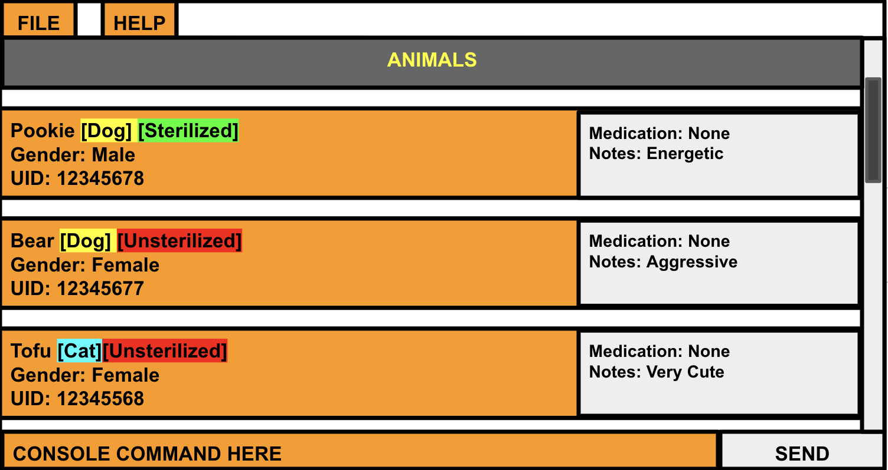

# PawFection User Guide

PawFection is a **desktop app for managing animals in a pet shelter, optimized for use via a Command Line Interface** (CLI) while still
having the benefits of a Graphical User Interface (GUI). It aims to provide a platform for volunteers to store and retrieve information
about animals in a shelter easily. 

<!-- * Table of Contents -->
- [Quick start](#quick-start)
--------------------------------------------------------------------------------------------------------------------

## Quick start

1. Ensure you have Java `11` or above installed in your Computer.

2. Download the latest `pawfection.jar`.

3. Copy the file to the folder you want to use as the _home folder_ for your PawFection.

4. Open a command terminal, `cd` into the folder you put the jar file in, and use the `java -jar pawfection.jar` command to run the application. 
   A GUI similar to the below should appear in a few seconds. Note how the app contains some sample data. 
   

5. Type the command in the command box and press Enter to execute it. e.g. typing **`help`** and pressing Enter will open the help window. 
   Some example commands you can try:

   * `list` : Lists all contacts.

   * `add n/Pookie id/98765432 t/dog g/male a/37` : Adds a dog named 'Pookie' to the Address Book.

   * `delete 3` : Deletes the 3rd entry shown in the current list.

   * `clear` : Deletes all contacts.

   * `exit` : Exits the app.

6. Refer to the [Features](#features) below for details of each command.

--------------------------------------------------------------------------------------------------------------------

## Features

<box type="info" seamless>

**Notes about the command format:** 

* Words in `UPPER_CASE` are the parameters to be supplied by the user. 
  e.g. in `add n/NAME`, `NAME` is a parameter which can be used as `add n/Pookie`.

* Items in square brackets are optional. 
  e.g `n/NAME [t/TAG]` can be used as `n/John Doe t/friend` or as `n/John Doe`.

* Items with `…`​ after them can be used multiple times including zero times. 
  e.g. `[t/TAG]…​` can be used as ` ` (i.e. 0 times), `t/friend`, `t/friend t/family` etc.

* Parameters can be in any order. 
  e.g. if the command specifies `n/NAME p/PHONE_NUMBER`, `p/PHONE_NUMBER n/NAME` is also acceptable.

* Extraneous parameters for commands that do not take in parameters (such as `help`, `list`, `exit` and `clear`) will be ignored. 
  e.g. if the command specifies `help 123`, it will be interpreted as `help`.

* If you are using a PDF version of this document, be careful when copying and pasting commands that span multiple lines as space characters surrounding line-breaks may be omitted when copied over to the application.
</box>

### Entry Management

#### Adding an animal: `addanimal`
Adds an animal to the address book.

Format: `addanimal n/NAME id/ID t/TYPE g/GENDER a/AGE`

<box type="tip" seamless>

**Tip:** 
</box>

Examples:

#### Listing all animals: `list`
Shows a list of all animals in the address book.

Format: `list`

Expected outcome (success):\
Here is the list of all contacts in your address book:
1. Pookie 1234567 Dog Male 5y/o
2. Tofu 1234565 Cat Female 1y/o

#### Deleting an animal: `delete`
Deletes the specified animal from the address book.

Format: `delete INDEX`

* Deletes the animal at the specified `INDEX`.
* The index refers to the index number shown in the displayed list.
* The index **must be a positive integer** 1, 2, 3, …​

Examples:
* `list` followed by `delete 2` deletes the 2nd person in the address book.
* `find Betsy` followed by `delete 1` deletes the 1st person in the results of the `find` command.

#### Clearing all entries : `clear`
Clears all entries from the address book.

Format: `clear`

#### Exiting the program : `exit`
Exits the program.

Format: `exit`

#### Saving the data

PawFection data are saved in the hard disk automatically after any command that changes the data. There is no need to save manually.

#### Editing the data file

PawFection data are saved automatically as a JSON file `[JAR file location]/data/addressbook.json`. Advanced users are welcome to update data directly by editing that data file.

<box type="warning" seamless>

**Caution:**
If your changes to the data file makes its format invalid, AddressBook will discard all data and start with an empty data file at the next run.  Hence, it is recommended to take a backup of the file before editing it.
</box>

_Details coming soon ..._

--------------------------------------------------------------------------------------------------------------------

## FAQ

**Q**: How do I transfer my data to another Computer? 
**A**: Install the app in the other computer and overwrite the empty data file it creates with the file that contains the data of your previous AddressBook home folder.

--------------------------------------------------------------------------------------------------------------------

## Known issues

1. **When using multiple screens**, if you move the application to a secondary screen, and later switch to using only the primary screen, the GUI will open off-screen. The remedy is to delete the `preferences.json` file created by the application before running the application again.

--------------------------------------------------------------------------------------------------------------------

## Command summary

Action     | Format, Examples
-----------|----------------------------------------------------------------------------------------------------------------------------------------------------------------------
**Add**    | - `addcontact n/NAME id/ID t/TYPE g/GENDER a/AGE`
**Clear**  | `clear`
**Delete** | `delete INDEX`  e.g., `delete 3`
**Edit**   | `edit INDEX [n/NAME] [id/ID] [t/TYPE] [g/GENDER] [a/AGE]…​` `
**List**   | `list`
**Help**   | `help`
