# Pawfection User Guide

## Welcome to Pawfection!
***Streamline Your Shelter: Pawfection - Commanding Care with a Click!***

Welcome to Pawfection, your **desktop application for managing animals in a pet shelter**, designed with **you**, the volunteer, in mind.
Pawfection aims to provide a platform for volunteers to **store and retrieve information** about **animals and tasks** easily, ensuring seamless
coordination within the shelter.

## Why Choose Pawfection?

With Pawfection, experience a new level of convenience and control:

* **User-Friendly** - Experience the best of both worlds with Pawfection's seamless Command Line Interface (CLI) and Graphical User Interface (GUI) integration, tailored for effortless navigation.
* **Unified Animal Dashboard** - Access all your shelter's animal data at a glance with our centralized information system.
* **Effortless Animal Management** - Streamlined with user-friendly tools, effortlessly add, edit, remove, and save animal details in a matter of seconds.
* **Streamlined Task Tracking** - Manage your shelter's daily duties with ease using Pawfection's straightforward task management features.

## Revolutionise Your Shelter Today!
**Begin your Pawfection Journey** - New to Pawfection? Get started with our [Quick Start Guide](#quick-start)!

---

## Table of Contents

<!-- * Table of Contents -->
- [Quick start](#quick-start)
- [Features](#features)
    - [Attributes of `Animal`](#attributes-of-animal)
    - [Program usage help: `help`](#program-usage-help-help)
    - [Adding an animal: `add`](#adding-an-animal-add)
    - [Listing all animals: `list`](#listing-all-animals-list)
    - [Deleting an animal: `delete`](#deleting-an-animal-delete)
    - [Editing an animal: `edit`](#editing-an-animal-edit)
    - [Searching an animal: `search`](#searching-an-animal-search)
    - [Adds a task to an animal: `addtask`](#adds-a-task-to-an-animal-addtask)
    - [Deletes a task of an animal: `deletetask`](#deletes-a-task-of-an-animal-deletetask)
    - [Marking a task as done: `mark`](#marking-a-task-as-done-mark)
    - [Unmarking a task as done: `unmark`](#unmarking-a-task-as-done-unmark)
    - [Reset all tasks: `reset`](#reset-all-tasks-reset)
    - [Viewing animal details](#viewing-animal-details)
    - [Saving the data](#saving-the-data)
    - [Editing the data file](#editing-the-data-file)
- [FAQ](#faq)
- [Known issues](#known-issues)
- [Command summary](#command-summary)
--------------------------------------------------------------------------------------------------------------------

## Navigating the User Guide
Welcome to the Pawfection User Guide! Our goal is to empower you with the knowledge and confidence to unleash the full potential of Pawfection.

* **Effortless Navigation:** Use the [table of contents](#table-of-contents) for seamless navigation between sections.
* **Quick Start for New Users:** New to Pawfection? Get started with our [Quick Start Guide](#quick-start) as we handhold you through the process of setting up Pawfection.
* **Features:** Learn more about Pawfection's features and how to use them with our [Features](#features) section.
* **Tutorial:** Get a step-by-step walkthrough of Pawfection's features with our [Tutorial](#pawfection-tutorial).

<box type="info">Look out for these boxes for things to note when using Pawfection</box>
<box type="tip">Look out for these boxes for tips and tricks on how to best use Pawfection</box>
<box type="warning">These boxes are for more context and warnings</box>
<box type="wrong">These boxes are for errors and failure messages</box>

[Back to Table of Contents](#table-of-contents)

---

## Quick start

1. **Check Java Installation.** Ensure you have Java `11` or above installed in your Computer.

<box type="info" light>
<tabs>
<tab header="Windows">

1. Press Win+R.
2. Type cmd and press Enter to open your terminal.
3. Type `java --version` and press Enter to check if java is installed.
4. If Java is not installed on your computer, a red error message will pop up. In that case, see below on installing Java 11.
5. If Java is installed on your computer, some lines of white text will appear. Among these, there should be a line reading openjdk followed by a number, which is the version of Java. If you do not have Java 11 or later, see below on installing Java 11.

</tab>
<tab header="Mac">

1. Press Command+Space.
2. Type Terminal and press Enter to open your terminal.
3. Type `java --version` and press Enter to check if java is installed.
4. If Java is not installed on your computer, a red error message will pop up. In that case, see below on installing Java 11.
5. If Java is installed on your computer, some lines of white text will appear. Among these, there should be a line reading openjdk followed by a number, which is the version of Java. If you do not have Java 11 or later, see below on installing Java 11.

</tab>
<tab header="Linux">

1. Open the terminal.
2. Type `java --version` and press Enter to check if java is installed.
3. If Java is not installed on your computer, a red error message will pop up. In that case, see below on installing Java 11.
4. If Java is installed on your computer, some lines of white text will appear. Among these, there should be a line reading openjdk followed by a number, which is the version of Java. If you do not have Java 11 or later, see below on installing Java 11.

</tab>
</tabs>

If Java 11 is not installed, follow the instructions [here](https://www3.ntu.edu.sg/home/ehchua/programming/howto/jdk_howto.html) to install Java 11.
</box>

2. **Download Pawfection.** Download the latest version of Pawfection (`pawfection.jar`.) from our [Github Release](https://github.com/AY2324S1-CS2103T-F08-3/tp/releases/tag/v1.4.final).
 
  

    
  

 

3. **Set Up Your Workspace.** Copy the file to the folder you want to use as the _home folder_ for your Pawfection.
<box type="tip"><md>We recommend creating a new folder named `Pawfection` to keep things organized!</md></box>

4. **Navigate to Workspace.** Navigate to the folder containing the `pawfection.jar` file using this method:
   - Right-click the folder and select `New Terminal at Folder` **(Mac)** or `Open in Terminal` **(Windows)** to instantly navigate to the folder in your **Terminal**.
      
     

       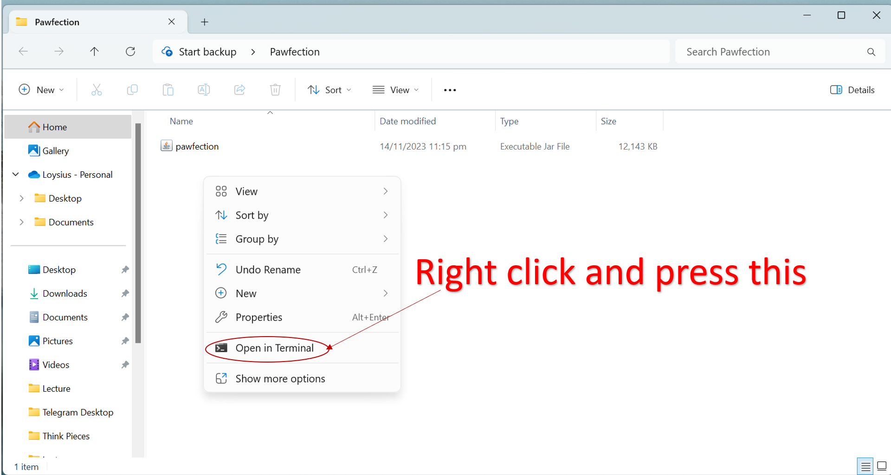
     

    
   
    - Alternatively, you can manually navigate to the folder using the `cd` command in your **Terminal**. 

5. **Run Pawfection.** Use the `java -jar pawfection.jar` command to run the application. 

   <box type="warning"><md>Ensure you are in the correct location when running the above command!</md></box>
 
  

    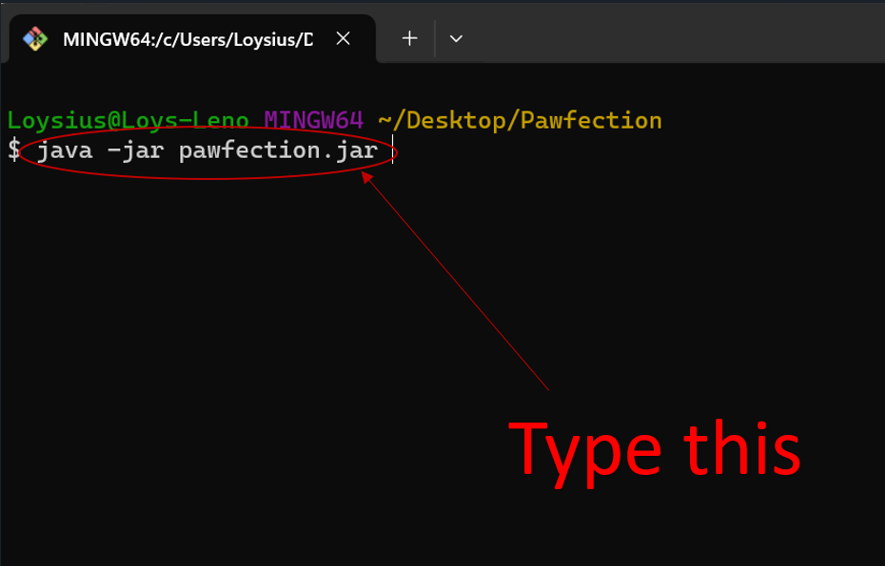
  

 

<box type="warning">The terminal may look different on different Operating System, that is fine.</box>

6. A GUI similar to the below should appear in a few seconds. Note how the app contains some sample data. 

  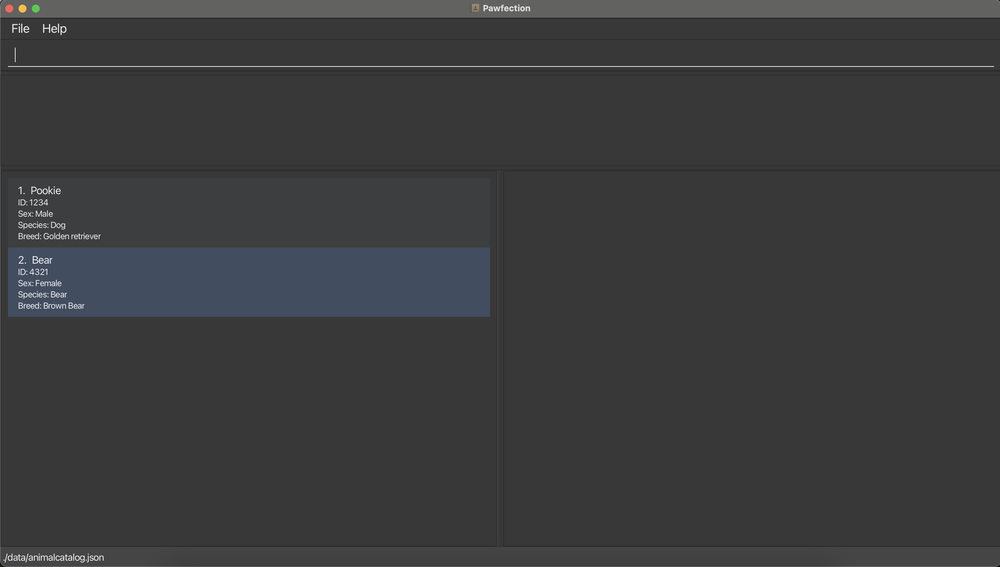

<box type="tip">Opt for full-screen mode to optimize your viewing experience!</box>

7. **Start using Pawfection!**
   - For new users, you can refer to our [Tutorial](#pawfection-tutorial) for a step-by-step walkthrough of Pawfection's features.
   - For advanced users, you can refer to our [Feature](#features) section and start using Pawfection.

[Back to Table of Contents](#table-of-contents)

--------------------------------------------------------------------------------------------------------------------

## Navigating the GUI

**Main Window**:
 
  

    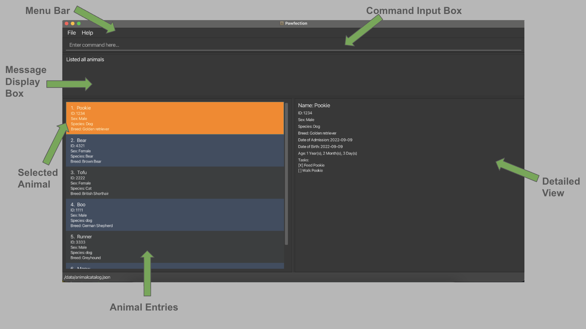
  

 

Here are the components of the Graphical User Interface (GUI), and their details.

GUI Components

| Component Name      | Details                                                                                                                                  |
|---------------------|------------------------------------------------------------------------------------------------------------------------------------------|
| Menu Bar            | Contains the drop down menus: **File** and **Help**.                                                                                     |
| Command Input Box   | Text box for users to input commands.                                                                                                    |
| Message Display Box | Box that displays result of command. Error messages will be displayed here as well.                                                      |
| Animal Entries      | Contains information about individual animals currently at the shelter, including: Name, ID, Sex, Species and Breed of animal.           |
| Selected Animal     | Animal that is selected either by left-clicking on the animal entry, or selected by a command. Selected animal is highlighted in orange. |
| Detailed View       | Box that contains more details about the currently selected animal.                                                                      |

 

[Back to Table of Contents](#table-of-contents)

---

## Pawfection Tutorial

1. **Starting Pawfection.** Launch Pawfection. You may refer to [here](#quick-start).
<box type="info">If this is your first time using Pawfection, you will see some sample data to help you get familiar!</box>

2. **Opening the Help Window.** The help window can be opened by typing `help` in the command box and pressing `Enter`. The URL to this user guide will be displayed as seen in the image below.

  

3. **Using the Help Command.** Now lets return to the main application and try using the `help` command more effectively by typing `help ad` and pressing `Enter`. A list of commands that contain the keyword `ad` will be displayed.

  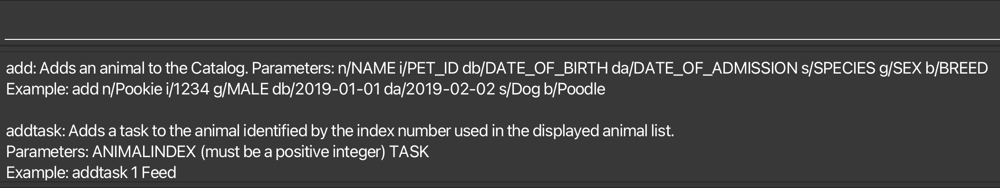

4. **Adding a New Animal.** Let us try to add a new animal. Type in `add n/Tofu i/0000 g/Male db/2019-01-01 da/2019-02-02 s/Dog b/Poodle` and press `Enter`. `Tofu` is now added to the animal list!

  

5. **Add more Animals.** Try it out yourself! Add more animals to the list using the `add` command.

6. **Searching for Animals.** Now that the list view is getting a little too crowded, let us try to search for animals. Type in `search n/Tofu` and press `Enter`. The animal list view will now only show animals with the name `Tofu`.

  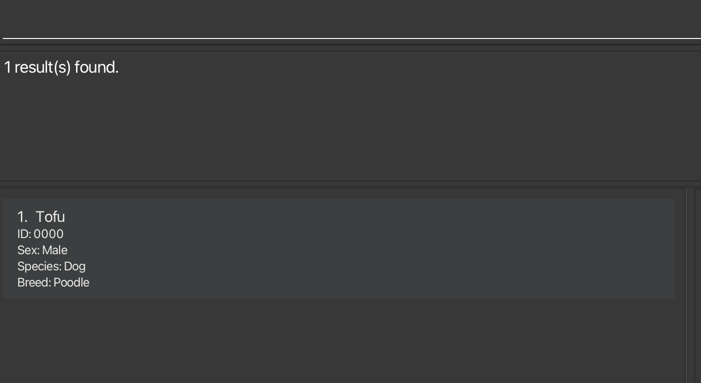

7. **Detailed Animal View.** Let us try to view the details of `Tofu`. Click on the `Tofu` card on the left of GUI. The animal details view on the right will now show the details of `Tofu`.

  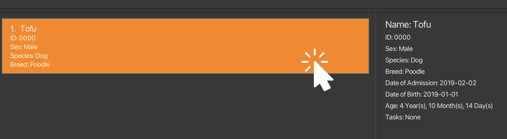

8. **Listing all Animals.** How do we return to the original list view of animals? Type in `list` and press `Enter`. The animal list view will now show all animals.

  

9. **Adding a Task.** Now add a task to `Tofu`. Type in `addtask 1 Feed Tofu` and press `Enter`. A task with the name `Feed Tofu` is now added to `Tofu`'s task list.

  

10. **Marking a Task as Done.** Type in `mark 3 1` and press `Enter`. The first task of `Tofu` is now marked as done.

  

Congratulations! You are now ready to use Pawfection! Click [here](#features) to explore other features.

[Back to Table of Contents](#table-of-contents)

---

## Features

### Command Format

Here are the **main components** of the commands:

|  Component   |     Example     |                                                    Description                                                    |
|:------------:|:---------------:|:-----------------------------------------------------------------------------------------------------------------:|
| Command Word | `add`, `search` |                                            The feature to be executed                                             |
|    Prefix    |   `n/`, `i/`    |                                        The type of attribute of the animal                                        |
|  Parameter   |  `NAME`, `ID`   |                       The value of the attribute of the animal, which is supplied by users                        |
|    Index     |    `1`, `2`     | The position of the animal or task in the current list, based on 1-indexing, i.e first animal will be at index 1. |

To view the full list of animal attributes, refer to [Attributes of `Animal`](#attributes-of-animal).

Here are the **additional symbols** used in the commands:

| Symbol |     Example      |                       Description                        |
|:------:|:----------------:|:--------------------------------------------------------:|
|  None  |     `n/NAME`     |            The parameter `NAME` is compulsory            |
| `[ ]`  |   `[b/BREED]`    |            The parameter `BREED` is optional             |
| `...`  | `TASK_INDEX ...` | Multiple parameters of type `TASK_INDEX` can be accepted |

<box type="info" header="Notes about the command format:">

* Parameters can be in any order **EXCEPT** commands that take in `ANIMAL_INDEX` and `TASK_INDEX` as inputs. 
  e.g. if the command specifies `n/NAME db/DOB`, `db/DOB n/NAME` is also acceptable.

* Extraneous parameters for some commands (e.g. `list`, `reset`, `search`) will be ignored. 
  e.g. if the command specifies `search 123 n/Pookie`, it will be interpreted as `search n/Pookie`.

* Prefixes are **case-sensitive**. `n/` is not the same as `N/`.

* If you are using a PDF version of this document, be careful when copying and pasting commands that span multiple lines as space characters surrounding line-breaks may be omitted when copied over to the application.

</box>

<box type="warning">
For longer error messages stated in the user guide, they have been shortened for brevity by displaying only the first few words followed by ellipsis.
</box>

---

### Attributes of `Animal`
Summarized in the table below are the attributes of `Animal` along with their constraints. Users are encouraged to read through
this table for an idea of what the attributes are supposed to look like, and refer to this table if they are unsure.

Attributes of <code>Animal</code>

| Format      | Constraints                                                                        | Example                                                                                                                                 |
|-------------|------------------------------------------------------------------------------------|-----------------------------------------------------------------------------------------------------------------------------------------|
| `n/NAME`    | Alphanumeric, not blank                                                            | <ul><li>✅ <code>n/Pookie</code></li><li>✅ <code>n/P00k13</code></li><li>❌ <code>n/&nbsp;</code></li><li>❌ <code>n/Be@r</code></li></ul> |
| `i/ID`      | 4-digit, unique number                                                             | <ul><li>✅ <code>i/1234</code></li><li>❌ <code>i/123A</code></li></ul>                                                                   |
| `g/SEX`     | Male/Female, case-insensitive                                                      | <ul><li>✅ <code>g/MALE</code></li><li>✅ <code>g/female</code></li><li>❌ <code>g/Mala</code></li></ul>                                   |
| `s/SPECIES` | Alphabets, separated by singular whitespace                                        | <ul><li>✅ <code>s/Komodo Dragon</code></li><li>❌ <code>s/Komodo &nbsp; Dragon</code></li></ul>                                          |
| `b/BREED`   | Alphabets, separated by singular whitespace                                        | <ul><li>✅ <code>b/Golden Retriever</code></li><li>❌ <code>b/Golden &nbsp; Retriever</code></li></ul>                                    |
| `db/DOB`    | `yyyy-MM-dd` format. Not in the future. Not chronologically later than `DOA`   | <ul><li>✅ <code>db/2023-01-01</code></li><li>❌ <code>db/2023-1-1</code></li></ul>                                                       |
| `da/DOA`    | `yyyy-MM-dd` format. Not in the future. Not chronologically earlier than `DOB` | <ul><li>✅ <code>da/2023-05-05</code></li></ul>                                                                                          |

 

[Back to Table of Contents](#table-of-contents)

--------------------------------------------------------------------------------------------------------------------

### Program usage help: `help`
Displays either a link to this User Guide in a pop-up, or the usage guide of the specified command.

 **Format:**
 <box>help [COMMAND_NAME]</box>

**Examples:**
* `help`
* `help add`
* `help del`

<box type="info" header="Things to note:">

* `COMMAND_NAME` is case-insensitive, and is able to do partial matches. E.g. "a", "ad", "dd", "AdD" will all match with "add".

</box>

**Upon success:**

* `help` will produce a link to the User Guide in a pop-up.

  

* `help add` will show usage guide of all commands that partial match with `add`.

  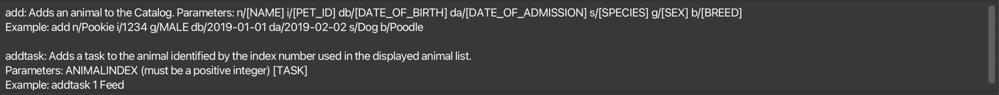

**Upon failure:**
* Inputs that result in no partial matches will produce the following error message:

  <box type="wrong">Command: COMMAND_NAME not recognized!</box>

[Back to Table of Contents](#table-of-contents)

--------------------------------------------------------------------------------------------------------------------

### Adding an animal: `add`
Adds an animal to the animal catalog.

**Format:**
<box>
add n/NAME i/ID g/SEX s/SPECIES b/BREED db/DOB da/DOA
</box>

**Examples:**
* `add n/Pookie i/1234 g/MALE db/2019-01-01 da/2019-02-02 s/Dog b/Poodle`
* `add n/Tofu i/1242 g/female db/2023-04-01 da/2023-05-25 s/cat b/British Shorthair`

<box type="info" header="Things to note:">

* Animals are uniquely identified by their ID. Hence, attempting to add a new animal that has an ID that already exists in the AnimalCatalog is not valid.
* Refer to [attributes of `Animal`](#attributes-of-animal) for a better idea of the constraints of each attribute.

</box>

**Upon success:**
* `add n/Tofu i/1242 g/female db/2023-04-01 da/2023-05-25 s/cat b/British Shorthair` adds Tofu to the list.

  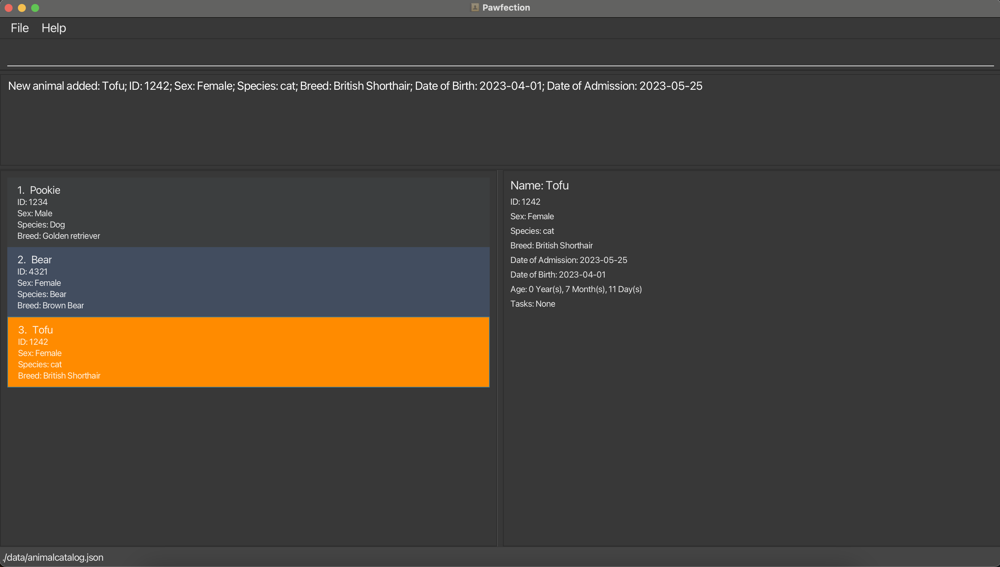

**Upon failure:**
* Attempts to `add` an animal with missing fields will produce the following error message listing the missing fields:
  <box type="wrong"> Invalid Command! Missing prefixes:...</box>

* Attempts to `add` an animal with an ID that already exists in the AnimalCatalog will produce the following error message:
  <box type="wrong"> This animal already exists in the Catalog</box>

* Attempts to `add` an animal with a wrong chronological DOB and DOA will produce the following error message:
  <box type="wrong"> Date of Birth:{DOB} should not be chronologically after Date of Admission:{DOA}!</box>

* Attempts to `add` an animal with a wrong date format, or a date that does not exist e.g. `2019-02-31` will produce the following error message:
  <box type="wrong"> Admission Date should be in the following format: '2023-10-15'</box>

[Back to Table of Contents](#table-of-contents)

--------------------------------------------------------------------------------------------------------------------

### Listing all animals: `list`
Shows a list of all animals in the animal catalog.

**Format:**
<box>list</box>

<box type="info" header="Things to note:">

* The list is sorted by the order in which the animals were added.

</box>

[Back to Table of Contents](#table-of-contents)

--------------------------------------------------------------------------------------------------------------------

### Deleting an animal: `delete`
Deletes the animal at the specified index from the animal catalog.

**Format:**
<box>delete INDEX</box>

**Examples:**
* `delete 2`

**Upon success:**
* `delete 2` deletes the animal at `INDEX 2`.

  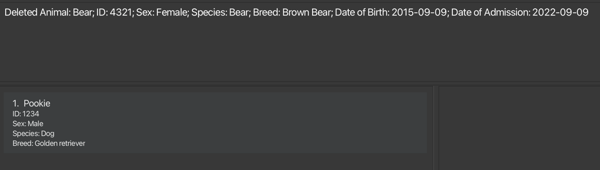

**Upon failure:**
* `delete -1` is not a valid command format due to `INDEX` not being positive and will produce the following error message:
  <box type="wrong">Invalid command format! delete: Deletes the animal..."</box>

* Invalid command formats will produce the following error message:
  <box type="wrong">Invalid command format! delete: Deletes the animal identified by..."</box>

[Back to Table of Contents](#table-of-contents)

--------------------------------------------------------------------------------------------------------------------

### Editing an animal: `Edit`
Edits animals specified by the index with the newly specified prefix attributes.

**Format:**
<box>edit INDEX [n/NAME] [g/SEX] [s/SPECIES] [b/BREED] [db/DOB] [da/DOA] </box>

**Examples:**
* `edit 2 n/Pookie`
* `edit 1 s/Dog b/Poodle`

<box type="info" header="Things to note:">

* ID cannot be edited.
* At least one prefix must be provided.
* Refer to [attributes of `Animal`](#attributes-of-animal) for a better idea of the constraints of each attribute.

</box>

**Upon success:**
* `edit 2 n/Pookie` edits the name of the animal at `INDEX 2` to be `Pookie`.

  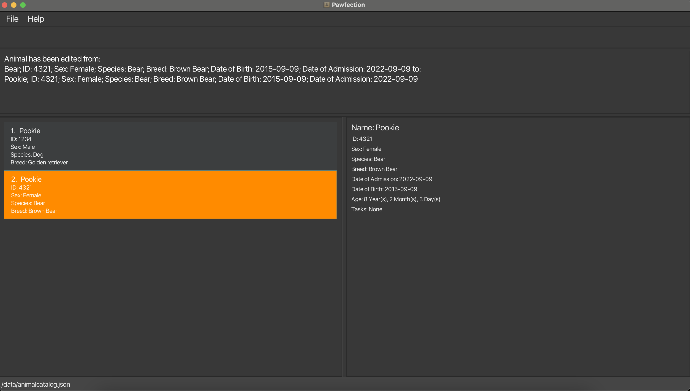

* `edit 1 s/Dog b/Poodle` edits the species of the animal at `INDEX 1` to be `Dog` and the breed to be `Poodle`.

  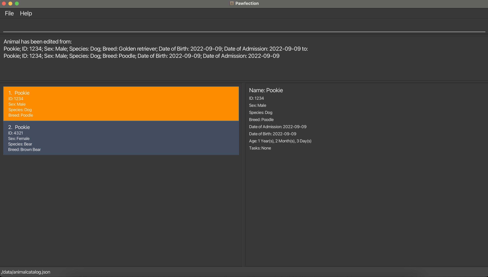

**Upon failure:**
* `edit -1` is an invalid command format due to `INDEX` not being positive and will produce the following error message:
  <box type="wrong"> Invalid command format! Example: edit 1... </box>

* `edit 100` is an invalid command format due to missing prefix and will produce the following error message:
  <box type="wrong"> At least one field to edit must be provided </box>

<box type="tip">Want to change the ID of the animal instead? Delete the current animal and add an animal with the new ID!</box>

[Back to Table of Contents](#table-of-contents)

--------------------------------------------------------------------------------------------------------------------

### Searching an animal: `Search`
Searches animals that are filtered using the specified prefixes.

**Format:**
<box>search [n/NAME] [i/ID] [g/SEX] [s/SPECIES] [b/BREED] [db/DOB] [da/DOA]</box>

**Examples:**
* `search n/Bear`
* `search n/Pookie b/Poodle`
* `search something n/Bear` is equivalent to `search n/Bear`
* `search nil/something n/Bear etc/else` is equivalent to `search n/Bear`
* `search something` and `search nil/other else/other` is equivalent to `search`

<box type="info" header="Things to note:">

* At least one prefix must be provided.
* The search is case-insensitive. e.g `n/pookie` will match animals named `Pookie`
* Searches will only return complete matches of its respective attributes, not partial matches. e.g. `search n/ear` will not match animals whose name contains `ear` like `Bear`, it will only search for animals whose names are spelt exactly `ear`.
* If searching by more than 1 prefix, the animal's attribute has to match all the specified fields e.g. `search b/dog n/tofu` will only return a dog named tofu and not any other dog or any pet named tofu
* Any unrecognized prefixes or empty prefix keywords provided will be ignored.
* Refer to [attributes of `Animal`](#attributes-of-animal) for a better idea of the constraints of each attribute.

</box>

**Upon success:**
* `search n/Bear` returns all animals with the name `Bear`, not animals whose species is `Bear`

  

* `search n/Pookie b/Poodle` returns all animals with the name `Pookie` and is of the breed `Poodle`

  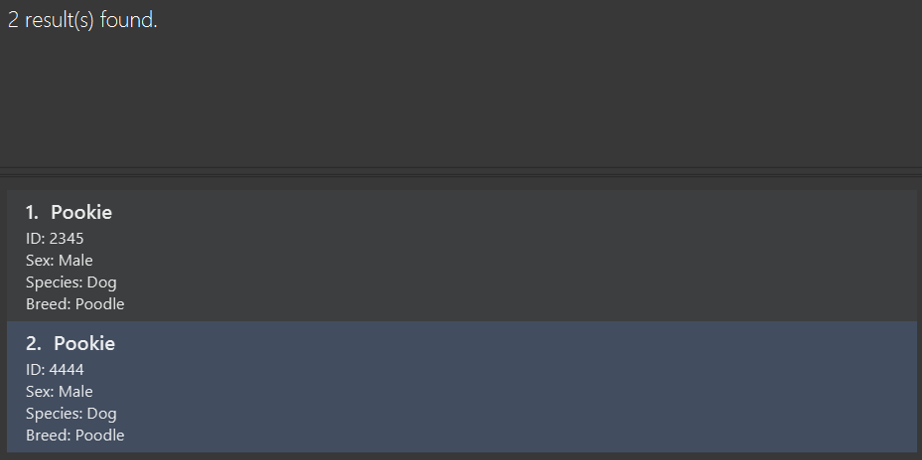

**Upon failure:**
* If no valid inputs are provided, the search will return the following error message.

  <box type="wrong"> Search keywords cannot be empty! At least one prefix must be provided. </box>

[Back to Table of Contents](#table-of-contents)

--------------------------------------------------------------------------------------------------------------------

### Adds a task to an animal: `addtask`
Adds a new task with the specified description to the task list of an animal.

**Examples:**
* `addtask 1 Feed Pookie`

**Format:**
<box>addtask ANIMAL_INDEX TASK</box>

<box type="info" header="Things to note:">

* The `TASK` refers to the description of the task that you want to add into the task list of the animal.
* Adding multiple `TASK` with the same description is allowed.

</box>

**Upon success:**
* `addtask 1 Feed Pookie` adds a task with name `Feed Pookie` to the task list of the first animal.

  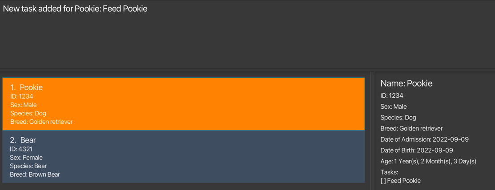

**Upon failure:**
* If the `ANIMAL_INDEX` provided is out of range, the following error message will be produced:
  <box type="wrong"> The animal index provided is invalid </box>

* If the `ANIMAL_INDEX` provided is negative or zero, the following error message will be produced:
  <box type="wrong"> Invalid command format! </box>

[Back to Table of Contents](#table-of-contents)

--------------------------------------------------------------------------------------------------------------------

### Deletes a task of an animal: `deletetask`
Deletes the task at the specified task index from the task list of the animal at the specified animal index.

**Format:**
<box>deletetask ANIMAL_INDEX TASK_INDEX</box>

**Examples:**
* `deletetask 1 1`

<box type="info" header="Things to note:">

* `ANIMAL_INDEX` and `TASK_INDEX` must be separated by a space. E.g. `deletetask 12` will be treated as delete task
  from animal with index 12, but because there is a missing `TASK_INDEX`, the command is invalid.

</box>

<box type="warning">

* The order in which `ANIMAL_INDEX` and `TASK_INDEX` is specified must be adhered to.
* E.g. If the user intends to delete the task with index 2 from the animal with index 1, then it must be `deletetask 1 2`.
* `deletetask 1 2` is not equivalent to `deletetask 2 1`.

</box>

**Examples:**
* `deletetask 1 1`

**Upon success:**
* `deletetask 1 1` deletes the first task from the first animal in the list

  

**Upon failure:**
* If the `ANIMAL_INDEX` provided is out of range, the following error message will be produced:
  <box type="wrong"> The animal index provided is invalid </box>

* If the `TASK_INDEX` provided is out of range, the following error message will be produced:
  <box type="wrong"> The task index provided is invalid </box>

* If the `ANIMAL_INDEX` or `TASK_INDEX` provided is negative or zero, the following error message will be produced:
  <box type="wrong"> Invalid command format! </box>

[Back to Table of Contents](#table-of-contents)

--------------------------------------------------------------------------------------------------------------------

### Marking a task as done: `mark`
Marks the task at the specified task index as done for the animal at the specified animal index.

**Format:**
<box>mark ANIMAL_INDEX TASK_INDEX [TASK_INDEX]...</box>

**Examples:**
* `mark 1 1`
* `mark 2 1 2`

<box type="info" header="Things to note:">

* If multiple `TASK_INDEX` are specified, all the tasks at the specified `TASK_INDEX` will be marked as done.
* All indexes must be separated by a space.
* If one of the `TASK_INDEX` provided is invalid, the rest of the `TASK_INDEX` will not be marked as done.
* Executing the `mark` command on task(s) previously marked as done will not cause an error to be thrown, and the task(s) would remain as marked.

</box>

<box type="warning">

* The order in which `ANIMAL_INDEX` and `TASK_INDEX` is specified must be adhered to.
* E.g. If the user intends to mark the task with index 2 from the animal with index 1, then it must be `mark 1 2`.
* `mark 1 2` is not equivalent to `mark 2 1`.

</box>

**Examples:**
* `mark 1 1`
* `mark 2 1 2`

**Upon success:**
* `mark 2 1 2` marks the first and second task of the second animal as done.

  

**Upon failure:**
* If no `TASK_INDEX` is provided, the following error message will be produced:
  <box type="wrong"> Task index(es) is/are missing! </box>

* If no `ANIMAL_INDEX` is provided, the following error message will be produced:
  <box type="wrong"> Animal index is missing! </box>

* If the `ANIMAL_INDEX` provided is out of range, the following error message will be produced:
  <box type="wrong"> The animal index provided exceeds the number of animals! </box>

* If any of the `TASK_INDEX` provided is out of range, the following error message will be produced:
  <box type="wrong"> The task index(es) provided exceeds the number of tasks in the animal! </box>

[Back to Table of Contents](#table-of-contents)

--------------------------------------------------------------------------------------------------------------------

### Unmarking a task as done: `unmark`
Marks the task at the specified task index as uncompleted for the animal at the specified animal index.

**Format:**
<box>unmark ANIMAL_INDEX TASK_INDEX [TASK_INDEX]...</box>

**Examples:**
* `unmark 1 1`
* `unmark 3 1 2`

<box type="info" header="Things to note:">

* If multiple `TASKINDEX` are specified, all the tasks at the specified `ANIMAL_INDEX` will be marked as uncompleted.
* All indexes must be separated by a space.
* If one of the `TASK_INDEX` provided is invalid, the rest of the `TASK_INDEX` will not be marked as uncompleted.
* Executing the `unmark` command on task(s) previously marked as uncomplete will not cause an error to be thrown, and the task(s) would remain as uncomplete (unmarked).

</box>

<box type="warning">

* The order in which `ANIMAL_INDEX` and `TASK_INDEX` is specified must be adhered to.
* E.g. If the user intends to mark the task with index 2 from the animal with index 1 as incomplete, then it must be `unmark 1 2`.
* `unmark 1 2` is not equivalent to `unmark 2 1`.

</box>

**Examples:**
* `unmark 1 1`
* `unmark 3 1 2`

**Upon success:**
* `unmark 3 1 2` marks the first and second task of the third animal as uncompleted.

  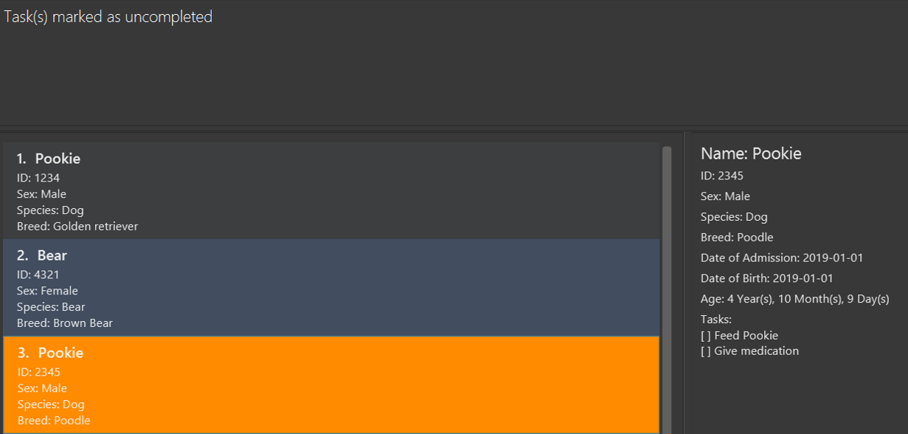

**Upon failure:**
* If no `TASK_INDEX` is provided, the following error message will be produced:
  <box type="wrong"> Task index(es) is/are missing! </box>

* If no `ANIMAL_INDEX` is provided, the following error message will be produced:
  <box type="wrong"> Animal index is missing! </box>

* If the `ANIMAL_INDEX` provided is out of range, the following error message will be produced:
  <box type="wrong"> The animal index provided exceeds the number of animals! </box>

* If any of the `TASK_INDEX` provided is out of range, the following error message will be produced:
  <box type="wrong"> The task index(es) provided exceeds the number of tasks in the animal! </box>

[Back to Table of Contents](#table-of-contents)

--------------------------------------------------------------------------------------------------------------------

### Reset all tasks: `reset`
Resets all tasks of all animals as uncompleted.

**Format:**
<box>reset</box>

<box type="info" header="Things to note:">

* Resets all tasks of all animals in the catalog as uncompleted, regardless of the current animal list view.

</box>

**Upon success:**
* `reset` will unmark all tasks of all animals and produce the following message:

  <box type="success"> All tasks are have been reset </box>

<box type="tip">Want to reset the daily task? Use `reset` instead of `unmark` to unmark every tasks at once!</box>

[Back to Table of Contents](#table-of-contents)

--------------------------------------------------------------------------------------------------------------------

### Viewing animal details
The detailed view panel on the right shows greater details about the selected animal. There are 2 ways to view the details of a certain animal:
* Left-click on the animal cell in the list of animals.
* Most animal-specific commands that involve specifying an `INDEX` of animal will automatically show the details of the animal in the detailed view. Commands include: `add`, `edit`, `addtask`, `deletetask`, `mark`, `unmark`.

The animal cell whose details are currently being displayed in the detail view will be highlighted in orange.

<box type="info">

* Note that certain commands will cause the selected animal and the detailed view to reset, and these include `list`, `delete`, `search`, and `help` commands.
* For invalid animal-specific commands, the selected animal will not change.

</box>

**Examples:**
* Selecting an animal in the first cell will display the details as shown below, with the selected cell highlighted in orange.

  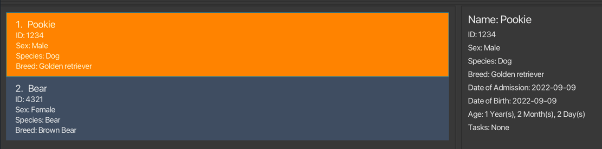

* `edit 2 n/Pooh` will automatically cause the animal at `INDEX 2` to show in the detailed view, since it is a command in the list of animal-specific commands.

  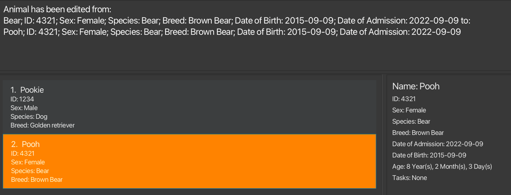

[Back to Table of Contents](#table-of-contents)

--------------------------------------------------------------------------------------------------------------------

### Saving the data

Pawfection data are saved in the hard disk automatically after any command that changes the data. There is no need to save manually.

--------------------------------------------------------------------------------------------------------------------

### Editing the data file

Pawfection data are saved automatically as a JSON file `[JAR file location]/data/animalcatalog.json`. Advanced users are welcome to update data directly by editing that data file.

<box type="warning" seamless>

*Caution:*
If your changes to the data file makes its format invalid, Pawfection will discard all data and start with an empty data file at the next run.  Hence, it is recommended to take a backup of the file before editing it.
</box>

--------------------------------------------------------------------------------------------------------------------

## FAQ

**Q**: How do I transfer my data to another Computer? 
**A**: Install the app in the other computer and overwrite the empty data file it creates with the file that contains the data of your previous Pawfection home folder.

--------------------------------------------------------------------------------------------------------------------

## Known issues

1. **When using multiple screens**, if you move the application to a secondary screen, and later switch to using only the primary screen, the GUI will open off-screen. The remedy is to delete the `preferences.json` file created by the application before running the application again.

--------------------------------------------------------------------------------------------------------------------

## Command summary

| Action         | Format, Examples                                                                                             |
|----------------|--------------------------------------------------------------------------------------------------------------|
| **Add**        | `add n/NAME i/ID db/DOB da/DOA g/SEX b/BREED s/SPECIES`                                                      |
| **Edit**       | `edit INDEX [n/NAME] [g/SEX] [s/SPECIES] [b/BREED] [db/DOB] [da/DOA]`                                        |
| **Delete**     | `delete INDEX`  e.g., `delete 3`                                                                          |
| **List**       | `list`                                                                                                       |
| **Search**     | `search [n/NAME] [i/ID] [g/SEX] [s/SPECIES] [b/BREED] [db/DOB] [da/DOA]`  e.g. `search n/Pookie b/Poodle` |
| **Addtask**    | `addtask ANIMAL_INDEX TASK`  e.g. `addtask 1 Feed Pookie`                                                 |
| **Deletetask** | `deletetask ANIMAL_INDEX TASK_INDEX`  e.g. `deletetask 1 1`                                               |
| **Mark**       | `mark ANIMAL_INDEX TASK_INDEX [TASK_INDEX]...`  e.g. `mark 2 1 2`                                         |
| **Unmark**     | `unmark ANIMAL_INDEX TASK_INDEX [TASK_INDEX]...`  e.g. `unmark 2 1 2`                                     |
| **Reset**      | `reset`                                                                                                      |
| **Help**       | `help [COMMAND_NAME]`                                                                                        |

[Back to Table of Contents](#table-of-contents)
