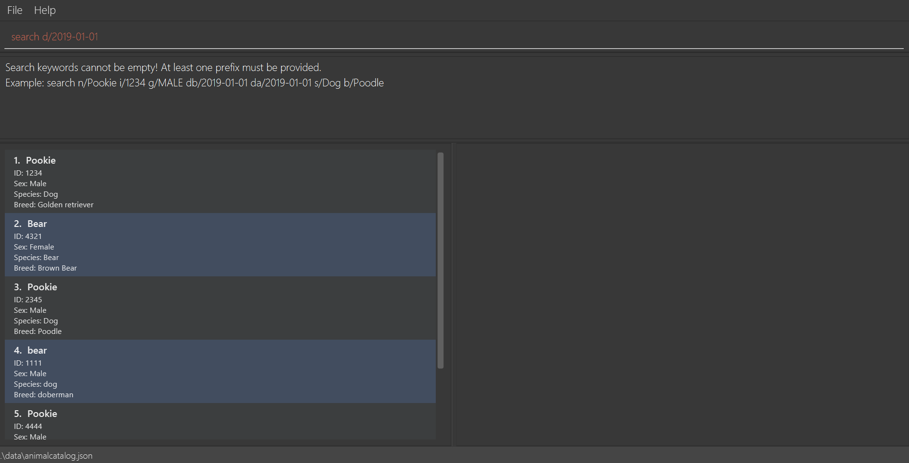
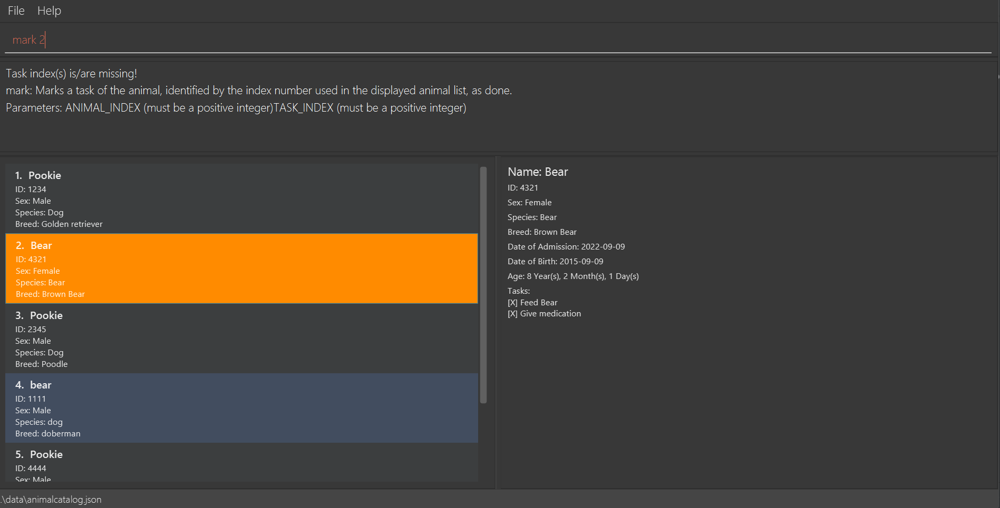

# Pawfection User Guide

Pawfection is a **desktop app for managing animals in a pet shelter, optimized for use via a Command Line Interface** (CLI) while still
having the benefits of a Graphical User Interface (GUI). It aims to provide a platform for volunteers to store and retrieve information
about animals in a shelter easily.

<!-- * Table of Contents -->
- [Quick start](#quick-start)
- [Features](#features)
    - [Adding an animal: `add`](#adding-an-animal-add)
    - [Program usage help: `help`](#program-usage-help-help)
    - [Listing all animals: `list`](#listing-all-animals-list)
    - [Deleting an animal: `delete`](#deleting-an-animal-delete)
    - [Editing an animal: `edit`](#editing-an-animal-edit)
    - [Searching an animal: `search`](#searching-an-animal-search)
    - [Adds a task to an animal: `addtask`](#adds-a-task-to-an-animal-addtask)
    - [Deletes a task of an animal: `deletetask`](#deletes-a-task-of-an-animal-deletetask)
    - [Marking a task as done: `mark`](#marking-a-task-as-done-mark)
    - [Unmarking a task as done: `unmark`](#unmarking-a-task-as-done-unmark)
    - [Reset all tasks: `reset`](#reset-all-tasks-reset)
    - [Viewing animal details](#viewing-animal-details)
    - [Saving the data](#saving-the-data)
    - [Editing the data file](#editing-the-data-file)
- [FAQ](#faq)
- [Known issues](#known-issues)
- [Command summary](#command-summary)
--------------------------------------------------------------------------------------------------------------------

## Quick start

1. Ensure you have Java `11` or above installed in your Computer.

2. Download the latest `pawfection.jar`.

3. Copy the file to the folder you want to use as the _home folder_ for your PawFection.

4. Open a command terminal, `cd` into the folder you put the jar file in, and use the `java -jar pawfection.jar` command to run the application. 
   A GUI similar to the below should appear in a few seconds. Note how the app contains some sample data. 
   

5. Type the command in the command box and press Enter to execute it. e.g. typing **`help`** and pressing Enter will open the help window.
   Typing the name of a command typing `help`, like `help add` will display the usage guide of the [add](#adding-an-animal-add) command.
   For more details, see [help](#program-usage-help-help) 
   Some example commands you can try:

    * `list` : Lists all contacts.

    * `add n/Pookie i/1234 g/MALE db/2019-01-01 da/2019-02-02 s/Dog b/Poodle` : Adds a dog named 'Pookie' to the Address Book.

    * `delete 3` : Deletes the animal with INDEX 3 in the displayed animal list.

6. Refer to the [Features](#features) below for details of each command.

--------------------------------------------------------------------------------------------------------------------

## Features

**Notes about the command format:** 

* Words in `UPPER_CASE` are the parameters to be supplied by the user. 
  e.g. in `add n/NAME`, `NAME` is a parameter which can be used as `add n/Pookie`.

* Items in square brackets are optional. 
  e.g `n/NAME [s/Dog]` can be used as `n/Pookie s/Dog` or as `n/Pookie`.

* Parameters can be in any order. 
  e.g. if the command specifies `n/NAME db/DOB`, `db/DOB n/NAME` is also acceptable.

* Extraneous parameters for commands that do not take in parameters (such as `list`) will be ignored. 
  e.g. if the command specifies `list 123`, it will be interpreted as `list`.

* If you are using a PDF version of this document, be careful when copying and pasting commands that span multiple lines as space characters surrounding line-breaks may be omitted when copied over to the application.
  </box>

**Notes about commands** 
* For all valid format commands that require to specify an animal `INDEX`, if the `INDEX` provided is out of range, the following error message will be produced: `"The animal index provided is invalid"`.
* For longer error messages stated in the user guide, they have been shortened for brevity by displaying only the first few words followed by ellipsis.

### Adding an animal: `add`
Adds an animal to the address book.

Format: `add n/NAME i/ID g/SEX s/SPECIES b/BREED db/DOB da/DOA`

* ID must be a unique 4 digit number.
* SEX must be either `male` or `female`. Note that it is NOT case-sensitive.
* Date of Birth (DOB) and Date of Admission (DOA) must be in the format `YYYY-MM-DD`. e.g. `2019-01-01` for 1st January 2019.
* DOB must come chronologically before DOA.
* Species and breed can only be alphabetic with only a single space between words. There can only be a maximum of 2 words in the species and breed.
* Animals are uniquely identified by their ID, and hence adding a new animal that has an ID that already exists in the AnimalCatalog is not valid.
* Attempts to `add` an animal with missing fields will produce the following error message listing the missing fields: `"Invalid Command! Missing prefixes:..."`
* Attempts to `add` an animal with an ID that already exists in the AnimalCatalog will produce the following error message: `"This animal already exists in the Catalog"`
* Attempts to `add` an animal with a wrong chronological DOB and DOA will produce the following error message: `"Date of Birth:{DOB} should not be chronologically after Date of Admission:{DOA}!"`, where {DOB} and {DOA} are inputted fields.
* Attempts to `add` an animal with a wrong date format, or a date that does not exist e.g. `2019-02-31` will produce the following error message: `"Admission Date should be in one of the following formats: '2023-10-15'"`

Examples:
* `add n/Pookie i/1234 g/MALE db/2019-01-01 da/2019-02-02 s/Dog b/Poodle`
* `add n/Tofu i/1242 g/female db/2023-04-01 da/2023-05-25 s/cat b/British Shorthair`

### Program usage help: `help`
Displays either a link to this User Guide in a pop-up, or the usage guide of the specified command.

Format: `help [COMMAND_NAME]`

* COMMAND_NAME is case-insensitive, and is able to do partial matches. E.g. "a", "ad", "dd", "AdD" will all match with "add".
* Inputs that result in no partial matches will produce the following error message: `"Command: {COMMAND_NAME} not recognized!"`, where {COMMAND_NAME} is the inputted field.

Examples:
* `help` will produce a link to the User Guide in a pop-up.

* `help add` will show usage guide of all commands that partial match with `add`.

* `help dele` will show usage guide of all commands that partial match with `dele`.

### Listing all animals: `list`
Shows a list of all animals in the address book.

Format: `list`

* The list is sorted by the order in which the animals were added.
* Can be used after using the `search` command to list all animals again.
* Any words after `list` will be ignored.

### Deleting an animal: `delete`
Deletes the specified animal from the address book.

Format: `delete INDEX`

* Deletes the animal at the specified `INDEX`.
* The `INDEX` refers to the animal of the `INDEX` on the animal list view, and is a positive number.
* `INDEX` is based on 1-indexing, i.e first animal will be at index 1.
* Invalid command formats will produce the following error message: `"Invalid command format! delete: Deletes the animal identified by..."`

Examples:
* `delete 2` deletes the animal at `INDEX 2`.

* `delete -1` is not a valid command format due to `INDEX` not being positive and will produce the following error message: `"Invalid command format! delete: Deletes the animal..."`

### Editing an animal: `Edit`
Edits animals specified by the index with the newly specified prefix attributes.

Format: `edit INDEX [n/NAME] [g/SEX] [s/SPECIES] [b/BREED] [db/DOB] [da/DOA]`

* ID cannot be edited.
* At least one prefix must be provided.
* Prefixes that are not provided will not be edited.
* The `INDEX` refers to the animal of the `INDEX` on the animal list view.
* `INDEX` is based on 1-indexing, i.e first animal will be at index 1.
* `INDEX` must be a positive integer 1, 2, 3, ...
* The order of prefixes does not matter. e.g. both `1 n/Pookie s/Cat` and `1 s/Cat n/Pookie `will edit the animal at index 1 to species `Cat` and name `Pookie`.

Examples:
* `edit 2 n/Pookie` edits the name of the animal at `INDEX 2` to be `Pookie`.

* `edit 1 s/Dog b/Poodle` edits the species of the animal at `INDEX 1` to be `Dog` and the breed to be `Poodle`.

* `edit -1` is an invalid command format due to `INDEX` not being positive and will produce the following error message: `"Invalid command format! Example: edit 1..."`
* `edit 100` is an invalid command format due to missing prefix and will produce the following error message: `"At least one field to edit must be provided"`

### Searching an animal: `Search`
Searches animals that are filtered using the specified prefixes.

Format: `search [n/NAME] [i/ID] [g/SEX] [s/SPECIES] [b/BREED] [db/DOB] [da/DOA]`

* Searches for animals whose attributes contain the specified search values in the prefix filter.
* The search is case-insensitive. e.g `n/pookie` will match animals named `Pookie`
* The order of prefixes does not matter. e.g. both `n/Pookie i/1234` and `i/1234 n/Pookie `will match animals named `Pookie` with ID `1234`
* Searches will only return complete matches of its respective attributes, not partial matches. e.g. `search n/ear` will not match animals whose name contains `ear` like `Bear`, it will only search for animals whose names are spelt exactly `ear`.
* If searching by more than 1 prefix, the animal's attribute has to match all the specified fields e.g. `search b/dog n/tofu` will only return a dog named tofu and not any other dog or any pet named tofu
* Any characters or words after `search` and before any recognized prefixes will be ignored.
* Any unrecognized prefixes will be ignored and will not be treated as a keyword to search for.
* Valid prefixes include: `n/`, `i/`, `g/`, `s/`, `b/`, `db/`, `da/`
* There must be at least 1 prefix specified.
* For fields that take in dates (`db/` and `da/`), the date must be in the format `YYYY-MM-DD`. e.g. `2019-01-01` for 1st January 2019.

Examples:
* `search n/Bear` returns all animals with the name `Bear`, not animals whose species is `Bear`

* `search n/Pookie b/Poodle` returns all animals with the name `Pookie` and is of the breed `Poodle`

* `search something n/Bear` is equivalent to `search n/Bear`
* `search nil/something n/Bear etc/else` is equivalent to `search n/Bear`
* `search something` and `search nil/other else/other` is equivalent to `search`
* If no valid inputs are provided, the search will return the following error message.

### Adds a task to an animal: `addtask`
Adds a specific new task to the task list of an animal.

Format: `addtask ANIMALINDEX TASK`
* Adds a task with name `TASK` to the task list of the animal at the specified `ANIMALINDEX`.
* The `ANIMALINDEX` refers to the index of the animal on the current animal list view.
* The `TASK` refers to the task that you want to add into the task list of the animal.
* `TASK` can include spaces.
* `ANIMALINDEX` is based on 1-indexing, i.e first animal will be at index 1.

Examples:
* `addtask 1 Feed Pookie` adds a task with name `Feed Pookie` to the task list of the first animal.

### Deletes a task of an animal: `deletetask`
Deletes a specific task from the task list of an animal.

Format: `deletetask ANIMALINDEX TASKINDEX`
* Deletes the task at the specified `TASKINDEX` from the task list of the animal at the specified `ANIMALINDEX`.
* The `ANIMALINDEX` refers to the index of the animal on the current animal list view.
* The `TASKINDEX` refers to the index of the task on the task list of the animal.
* `ANIMALINDEX` and `TASKINDEX` are based on 1-indexing, i.e first animal will be at index 1.
* `ANIMALINDEX` and `TASKINDEX` must be separated by a space.

Examples:
* `deletetask 1 1` deletes the first task of the first animal.

### Marking a task as done: `mark`
Marks the specified task as done.

Format: `mark ANIMALINDEX TASKINDEX [TASKINDEX]...`
* Marks the task at the specified `TASKINDEX` as done for the animal at the specified `ANIMALINDEX`.
* The `ANIMALINDEX` refers to the index of the animal on the current animal list view.
* The `TASKINDEX` refers to the index of the task on the task list of the animal.
* If multiple `TASKINDEX` are specified, all the tasks at the specified `TASKINDEX` will be marked as done.
* `TASKINDEX` must be separated by a space.
* If one of the `TASKINDEX` provided is invalid, the rest of the `TASKINDEX` will not be marked as done.
* Executing the `mark` command on task(s) previously marked as done will not cause an error to be thrown, and the task(s) would remain as marked.

Examples:
* `mark 1 1` marks the first task of the first animal as done.
* `mark 2 1 2` marks the first and second task of the second animal as done.

* If invalid inputs/no inputs are provided, the mark command will produce the following error message.

### Unmarking a task as done: `unmark`
Marks the specified task as uncompleted.

Format: `unmark ANIMALINDEX TASKINDEX [TASKINDEX]...`
* Marks the task at the specified `TASKINDEX` as uncompleted for the animal at the specified `ANIMALINDEX`.
* The `ANIMALINDEX` refers to the index of the animal on the current animal list view.
* The `TASKINDEX` refers to the index of the task on the task list of the animal.
* If multiple `TASKINDEX` are specified, all the tasks at the specified `TASKINDEX` will be marked as uncompleted.
* `TASKINDEX` must be separated by a space.
* If one of the `TASKINDEX` provided is invalid, the rest of the `TASKINDEX` will not be marked as uncompleted.
* Executing the `unmark` command on task(s) previously marked as uncomplete will not cause an error to be thrown, and the task(s) would remain as uncomplete (unmarked).

Examples:
* `unmark 1 1` marks the first task of the first animal as uncompleted.
* `unmark 3 1 2` marks the first and second task of the third animal as uncompleted.

  *If invalid inputs/no inputs are provided, the unmark command will produce the following error message.

### Reset all tasks: `reset`
Resets all tasks of all animals as uncompleted.

Format: `reset`
* Resets all tasks of all animals in the catalog as uncompleted, regardless of the current animal list view.
* Any words after `reset` will be ignored.

### Viewing animal details
The detailed view panel on the right shows greater details about the selected animal. There are 2 ways to view the details of a certain animal:
* Left-click on the animal cell in the list of animals.
* Most animal-specific commands that involve specifying an `INDEX` of animal will automatically show the details of the animal in the detailed view. Commands include: `add`, `edit`, `addtask`, `deletetask`, `mark`, `unmark`.

The animal cell whose details are currently being displayed in the detail view will be highlighted in orange.
* Note that certain commands will cause the selected animal and the detailed view to reset, and these include `list`, `delete`, `search`, and `help` commands.
* For invalid animal-specific commands, the selected animal will not change.

Examples:
* Selecting an animal in the first cell will display the details as shown below, with the selected cell highlighted in orange.

* `edit 2 n/Pooh` will automatically cause the animal at `INDEX 2` to show in the detailed view, since it is a command in the list of animal-specific commands.

### Saving the data

Pawfection data are saved in the hard disk automatically after any command that changes the data. There is no need to save manually.

### Editing the data file

Pawfection data are saved automatically as a JSON file `[JAR file location]/data/animalcatalog.json`. Advanced users are welcome to update data directly by editing that data file.

<box type="warning" seamless>
**Caution:**
If your changes to the data file makes its format invalid, AddressBook will discard all data and start with an empty data file at the next run.  Hence, it is recommended to take a backup of the file before editing it.
</box>

--------------------------------------------------------------------------------------------------------------------

## FAQ

**Q**: How do I transfer my data to another Computer? 
**A**: Install the app in the other computer and overwrite the empty data file it creates with the file that contains the data of your previous AddressBook home folder.

--------------------------------------------------------------------------------------------------------------------

## Known issues

1. **When using multiple screens**, if you move the application to a secondary screen, and later switch to using only the primary screen, the GUI will open off-screen. The remedy is to delete the `preferences.json` file created by the application before running the application again.

--------------------------------------------------------------------------------------------------------------------

## Command summary

| Action         | Format, Examples                                                                                             |
|----------------|--------------------------------------------------------------------------------------------------------------|
| **Add**        | `add n/NAME i/ID db/DOB da/DOA g/SEX b/BREED s/SPECIES`                                                      |
| **Edit**       | `edit INDEX [n/NAME] [g/SEX] [s/SPECIES] [b/BREED] [db/DOB] [da/DOA]`                                        |
| **Delete**     | `delete INDEX`  e.g., `delete 3`                                                                          |
| **List**       | `list`                                                                                                       |
| **Search**     | `search [n/NAME] [i/ID] [g/SEX] [s/SPECIES] [b/BREED] [db/DOB] [da/DOA]`  e.g. `search n/Pookie b/Poodle` |
| **Addtask**    | `addtask ANIMALINDEX TASK`  e.g. `addtask 1 Feed Pookie`                                                  |
| **Deletetask** | `deletetask ANIMALINDEX TASKINDEX`  e.g. `deletetask 1 1`                                                 |
| **Mark**       | `mark ANIMALINDEX TASKINDEX [TASKINDEX]...`  e.g. `mark 2 1 2`                                            |
| **Unmark**     | `unmark ANIMALINDEX TASKINDEX [TASKINDEX]...`  e.g. `unmark 2 1 2`                                        |
| **Reset**      | `reset`                                                                                                      |
| **Help**       | `help [COMMAND_NAME]`                                                                                        |
